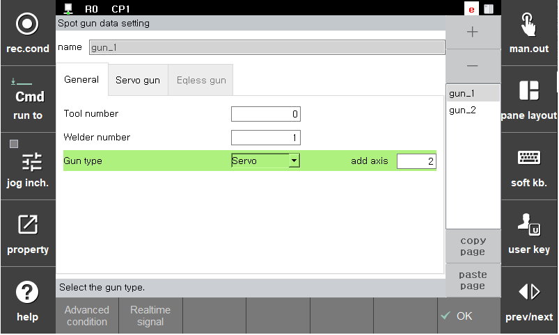

# 2.1.1 Setting of the tool number and gun type corresponding to the gun number

This function sets the tool number and gun type corresponding to the spot welding gun number. It supports in a way that a vriety of welding guns can be configured to match with the use of individual welders and tool numbers. Because the welding method varies depending on the gun type, the setting must be performed correctly. Guns can be added using the '+' sign on the right and up to 16 guns can be added.

 </img>
 <em>
Figure 2.2 Gun default setting
</em>

‘Welder’ is for designating the welder linked with the relevant gun number. When welding is performed with the relevant gun, the signal is inputted to and outputted from the port that matches with the setting of the relevant welder. Multiple guns can be shared and used through the servo tool change function. 

‘Tool’ refers to an object coupled with the tip of the R1 axis of the robot, and the robot should know the tool information. ‘Tool number’ refers to the tool number to be matched with the relevant gun number, and there should be load estimation and tool data inputted in the relelvant tool number. In general, individual gun have different shapes, so a unique ‘tool number’ should be selected for each gun number.As stationary guns are not to be coupled with the tip of the R1 axis, it would be no problem to perform arbitrary setting for them. During the work teaching, if the gun number of the Spot command and the tool number of the Move command are not matched with eath other, playback will not be possible. Please note this.  

‘Gun type’ refers to the gun type of the relevant gun. You can select one among three types. If the gun type of the relevant gun is servo gun, the information of the additional axis assigned to the relevant gun should be inputted. When it comes to the information of the additional axis, the same additional axis can be assigned to multiple guns during the use of the servo tool change function. Please note this.

 

◆【Note】◆ 

-	If the gun number corresponding to the tool number is not set, the tool number may be used for other purposes.

-	When setting the gun type as servo gun, it is required to set the additional axis number corresponding to the gun number in the following method.

|Gun number	|Gun usage|	Additional axis number|
|:---:|:---:|:---:|
|G1, G2|	Change of welding guns including the servo gun|	Additional axis 1|
|G5|	Stationary servo gun 1|	Additional axis 2|
|G6|	Stationary servo gun 2|	Additional axis 3|

