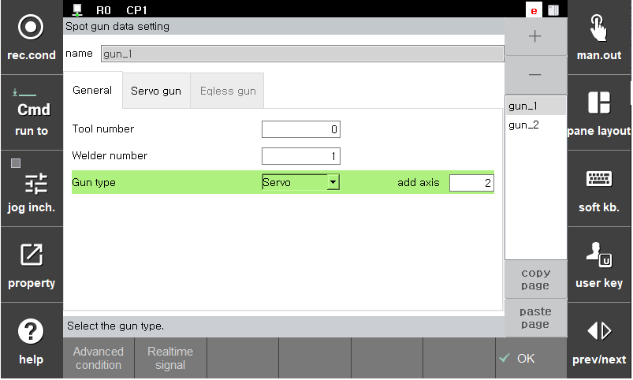

### 2.1.1 Setting of the tool number and gun type corresponding to the gun number

This function sets the tool number and gun type corresponding to each spot welding gun number.

It allows various welding guns to be configured according to the welder and tool number assigned to each. Since the welding method differs depending on the gun type, these settings must be configured correctly.

Guns can be added using the `[+]` button on the right, and up to 16 guns can be registered.

 </img>
 <em>
Figure 2.2 Gun default setting
</em>

(1) Tool number  
Tool refers to an object attached to the tip of the robot's R1 axis, and the robot must have the corresponding tool information registered. The tool number is the number assigned to match the corresponding gun number. The selected tool number must have the appropriate load estimation and tool data entered. Since each gun typically has a different shape, a unique tool number should be assigned to each gun number. Because stationary guns are not attached to the tip of the R1 axis, they may be assigned arbitrary tool settings without issue. During work teaching, if the gun number specified in the Spot command does not match the tool number specified in the `move` command, playback will not be possible. Please ensure these values are consistent.

(2) Welder number
Welder designates the welder associated with the corresponding gun number. When welding is performed with that gun, signals are input to and output from the ports assigned to the selected welder. Multiple guns can share and use the same welder through the servo tool change function.

(3) Gun type
Gun type indicates the type of the selected gun. One of three types can be chosen.
If the selected gun is a servo gun, the information for the additional axis assigned to that gun must be specified. For the additional axis information, the same additional axis may be assigned to multiple guns when using the servo tool change function.

 


-	If the gun number corresponding to the tool number is not set, the tool number may be used for other purposes.

-	When setting the gun type as servo gun, it is required to set the additional axis number corresponding to the gun number in the following method.  



|Gun number	|Gun usage|	Additional axis number|
|:---:|:---:|:---:|
|G1, G2|	Change of welding guns including the servo gun|	Additional axis 1|
|G5|	Stationary servo gun 1|	Additional axis 2|
|G6|	Stationary servo gun 2|	Additional axis 3|

