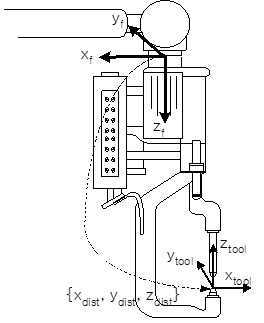

# 2.1.2 Setting of the tool angle/distance

When spot welding is performed, the equalizing operation (operation in which the fixed electrode contacts the panel after passing through the clearance position) is absolutely necessary. This operation requires the correct setting of the tool coordinate system. The +Z axis of the tool coordinate system should be set correctly in the direction from the fixed electrode to the moving electrode (Note: [**Hi6 Controller Operation Manual**](https://hyundai-robotics.gitbook.io/hi6-operation-manual/)).

 
  <em>
Figure 2.3 Setting of the tool length and angle of the welding gun
</em>
 </img>

*   **Tool length**

    When it comes to tool length, input the length from the center of the flange of the robot's R1 axis to the tip of the tool (the upper part of the fixed electrode), measured with a new, unconsumed electrode attached. Set the coordinate direction of the reference tool coordinate system as positive (+) and input the measured length X, Y, and Z values, or set the tool length using the automatic calibration function.
*   **Tool angle**

    Input the rotation angles (Rx, Ry, Rz) in three directions based on the flange coordinate system, or use the ‘Angle compensation’ function. Set the tool angle in a way that the upward direction of the fixed electrode can be +Z. To check it, set \[**Coordinate system**] of the teach pendant to 『**Tool**』, and press the \[**Up**] key of the jog key. Then, if thus set direction matches with the Z+ direction (the squeezing direction of the fixed electrode), the setting would suffice.

 

>    **In the case of the above figure, set the tool angle as {0 deg, 180 deg, 0 deg}.**

