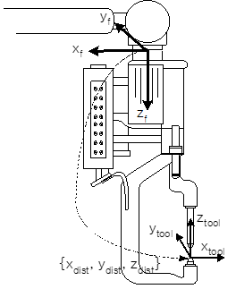

### 2.1.2 工具角度/距离的设定

在进行点焊时，均衡操作（固定电极在通过间隙位置后接触面板的过程）是必不可少的。此操作需要正确设置工具坐标系统。
工具坐标系统的 +Z 轴必须与固定电极指向移动电极的方向对齐。（注意：[控制器操作手册](https://hrbook-hrc.web.app/#/view/doc-hi6-operation/zh-tp630/README?cont_model=${cont_model})）。

 
  <em>
图 2.3 焊接枪的工具长度和角度的设定 : {0˚, 180˚, 0˚}
</em>
 </img>

 

*   工具长度

    在设置工具长度时，测量从机器人 R1 轴法兰中心到工具尖端（固定电极的上部）的距离，安装一个新、未使用的电极。

    使用参考工具坐标系统，并按照其正 (+) 轴方向进行测量。
    输入测量得到的 X、Y 和 Z 长度值。

    或者，可以通过菜单中的 `[F1: 自动 校准] ([F1: Auto calibration])` 功能设置工具长度。

 

*   工具角度

    根据法兰坐标系统输入三个轴的旋转角度 (Rx, Ry, Rz)，或使用 `[F2: 角度 校准] ([F2: Angle calibration])` 功能。

    设置工具角度，使固定电极的向上方向对应于工具坐标系统的 +Z。

    为了验证设置：

    1. 将教学挂件坐标系统设置为 `[crd.sys tool]` （在状态显示窗口中的第 4 个按钮）。

    2. 按下 `[Z+]` 移动键。

    3. 检查运动方向。

    如果运动方向与固定电极的挤压方向相匹配（图 2.3 中显示的向上方向），则工具角度设置是正确的。