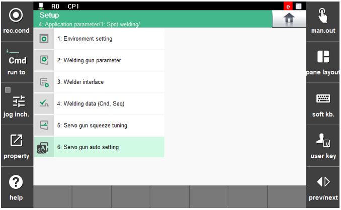
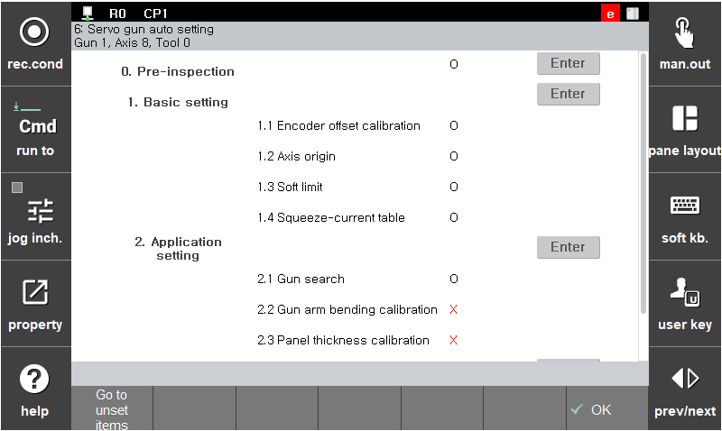

# 2.1 Procedure for initial setting of the servo gun

This function is related to spot welding and other applications that use a servo gun. If necessary to use a gun other than a servo gun (pneumatic gun, etc.), refer to only [2.1.1 Setting of the tool number and gun type corresponding to the gun number](1-tool-number-gun-type-setting.md) and [2.1.2 Setting of the tool angle/distance](2-tool-angle-distance-setting.md) in this chapter, and [3. Related functions](../../3-Related-functions/README.md) in the next chapter.

The initial setting of the servo gun is an essential process to makie it possible to perform spot welding using a servo gun. After completing the procedure for the initial setting of the servo gun, the following items will be possible.

* Operation of the moving electrode of the servo gun
* Squeeze with the specified squeezing force
* Signal input and output for spot welding

After completing the procedure for initial setting, you need to set related functions and spot welding parameters (welding conditions, sequence, etc.) according to the purpose of use, and then teach the work.

Through the `[6: Servo gun auto setting]` function (`[F2: system] - 4: Application parameter - 1: Spot welding`), our company provides settings and procedures for the environment for spot welding and servo gun operation.

 </img>
 <em>
Figure 2.1 Screen for entering the 'Servo gun automatic setting' menu
</em>


You can enter the menu only when the currently selected gun number is for the servo gun.
("**Additional axis parameter setting**", "**Load estimation**", "**Tool data inputting**", "**Welding gun paramater**" are the contents that should be essentially set prior to the servo gun automatic setting.) If multiple guns are to be used, their individual settings should be performed by chaning the gun number.


 

---

The initial setting for the servo gun and spot welding is performed largely in five steps as shown below, and the progress of each step will be indicated, allowing you to monitor the progress.

 </img>
 <em>
Figure 2.1.2 Procedure for 'servo gun automatic setting'
</em>

The standard procedure for the servo gun initial setting is as follows.

* [Step 0. Pre-inspection](../2-2-step-0-pre-inspection.md): Inspection of essential pre-setting items for the setting of the servo gun operation environment 
  * Additional axis parameter
  * Setting of the tool number corresponding to the gun number
  * Tool data setting (including load estimation)
  * Servo gun parameter setting
* [Step 1. Default setting](../2-3-step-1-default-setting/README.md): Setting of the servo gun operation environment
  * Encoder offset compensation
  * Axis origin setting
  * Soft limit setting
  * Squeezing force-current table setting
* [Step 2. Application setting](../2-4-step-2-application-setting/README.md): Setting of application functions that use the servo gun
  * Gun search
  * Gun arm deflection amount compensation
  * Panel thickness measurement compensation
* [Step 3. Setting check](../2-5-step-3-setting-check.md): Process for checking the current setting
* [Step 4. Signal setting](../2-6-step-4-signal-setting.md): Assignment of input and output signals for spot welding application

 

The servo gun initial setting procedure screen not only shows the indication process and the status about completion, but also makes it possible to proceed with related items or move to the screen where related items can be performed.

In other words, the initial setting related to the servo gun can all be completed from the above screen without going to relevant menus. The initial setting can be proceeded with in the following two ways.

1. Move the cursor to the relevant procedure and then input by selecting `[Enter]`.
2. Press `[F1: Go to unset items]` to automatically proceed with the initial setting not yet conducted.

The `[F1: Go to unset items]` butten makes it possible to inspect the procedures not yet conducted among all procedures, allowing them to be performed automatically. At the time of initial setting, you can complete the setting by following the guide just by clicking `[F1: Go to unset items]`.
