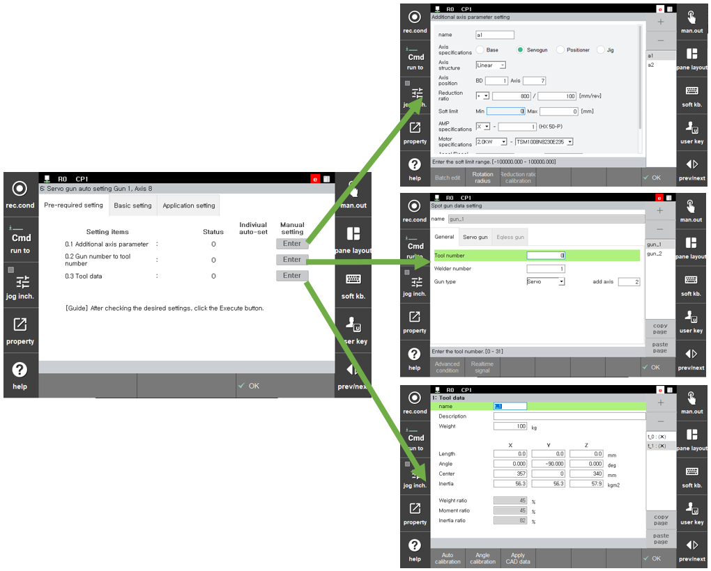

# 2.2 Step 0. 预检

预检是必须在伺服枪初始设置之前执行的项目，要求在进入主菜单之前完成以下设置。

* **附加轴参数**
  * 输入所需附加轴的伺服枪电机及功率放大器的规格等。
  * 软极限可以任意设置，因为在初始设置过程中会进行更改。
* **与枪编号对应的工具编号设置**&#x20;
  * 指定您现在想要设置的伺服枪和枪编号。
* **工具数据设置**
  * 输入负载估计、工具角度/长度等。
* **伺服枪参数设置**
  * 设置命令值偏移、挤压力允许误差等必要项目。

预检是检查预设置项目是否已完成的步骤。如果未执行，可以移动到可以进行相关设置的屏幕。在进行伺服枪的初始设置之前，必须完成相关设置。

 </img>
 <em>
图 2.4 预检程序
</em>


如果您在 "**附加轴参数设置**" 屏幕上完成设置，完成预检后会提示您重启。  

重启后，您应进入 "**伺服枪自动设置**" 屏幕并继续设置。 
