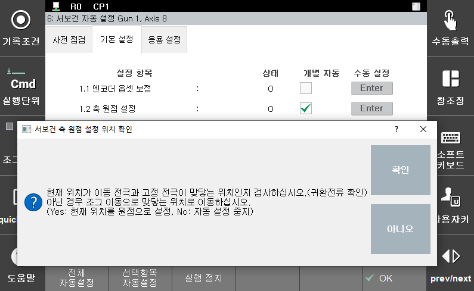
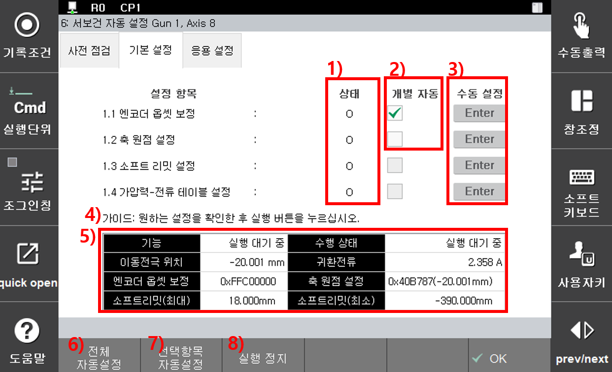

# 2.3.1 자동 설정

서보건 ‘**기본 설정**’의 자동 설정은 『**전체 자동 설정**』을 눌러 진행합니다. ‘**전체 자동 설정**’은 서보건의 이동전극이 자동으로 움직이기 때문에 아래의 조건이 반드시 만족되어야 합니다.

* 이동전극과 고정전극에 새 팁 부착
* 서보건 주변 작업자 부재
* 이동전극과 고정전극 사이에 작업물 부재
* 수동 모드
* 모터 온
* 이동전극 최대개방 금지(최대개방 위치와 일정거리 유격)

‘**전체 자동 설정**’은 다음과 같은 절차가 자동 진행됩니다.

    (1) 엔코더 옵셋 보정  
      - 이동 전극이 최대 개방 위치로 이동.  
      - 최대 개방 위치에서 정지 후 엔코더 옵셋 보정 실행
    (2) 축 원점 설정  
      - 서보건 3회 가압, 2회 개방 동작
      - 3번째 가압 후 두 전극이 만나는 위치로 이동
      - 해당 위치 사용자 확인
      - 축 원점 설정 실행
    (3) 소프트 리밋 설정  
      - 축 원점 설정 후 자동 실행
    (4) 가압력-전류 테이블 설정  
      - 설정을 위한 메뉴로 자동 이동

서보건 기본 설정의 자동 설정은 서보건의 ‘**엔코더 옵셋 보정**’ 위치와 ‘**축 원점 보정**’ 위치를 자동으로 인식하여 해당 위치에서 ‘**엔코더 옵셋 보정**’, ‘**축 원점 보정**’과 ‘**소프트 리밋 설정**’을 진행합니다. 기본 설정의 자동 설정은 ‘**가압력-전류 테이블 설정**’을 자동 진행하지 않습니다. “[**2.3.3 서보건 가압력 - 전류 테이블 튜닝**](2-3-3-servo-gun-force-current-table-tuning/)” 챕터를 참고하여 설정을 진행하십시오.

‘**전체 자동 설정**’ 시 축 원점 위치 이동 후 아래와 같이 사용자에게 축 원점 위치를 확인합니다. 이 때 이동 전극의 위치와 귀환 전류(1A 이하)를 확인하여 살짝 맞닿는 위치에 있으면 ‘**예**’를 눌러 설정을 계속 진행하십시오. 만약 귀환 전류가 높거나 이동 전극과 고정 전극이 맞닿지 않는 상태이면 조그 키를 이용하여 미세 조정 후 ‘예’를 누르십시오. 자동 설정을 원하지 않는 경우 ‘**아니오**’를 눌러 설정을 종료하십시오.

 </img>
 <em>
그림 2.6 축 원점 위치 사용자 확인
</em>


[**경고**] 서보건 최대 개방 위치에 범퍼와 같은 금속 재질이 아닌 스토퍼가 달려 있는 경우 최대 개방 위치 추정이 어려울 수 있으니, 제거 후 설정하는 것을 권장합니다.


서보건 기본 설정의 화면 구성과 기능은 아래와 같습니다.

 </img>
 <em>
그림 2.7 기본 설정 구성
</em>

>1. **상태**: 현재 서보건 설정 상태 (X:설정 전, O:완료, 변경 됨 중 하나)
>2. **개별 자동 설정**: 전체가 아닌 체크된 항목만 자동으로 설정하는 기능 지원. 『**선택 항목 자동 설정**』을 누르면 체크된 항목만 자동으로 진행됩니다.
>3. **수동설정**: 해당 항목을 설정할 수 있는 화면으로 이동  
    - 엔코더 옵셋 보정 : **설정**』 → 『**3: 로봇 파라미터**』 → 『**4: 엔코더 옵셋**』화면으로 이동   
    - 축 원점 설정 : **설정**』 → 『**3: 로봇 파라미터**』 → 『**2: 축 원점**』화면으로 이동   
    - 소프트 리밋 설정 : **설정**』 → 『**3: 로봇 파라미터**』 → 『**3: 소프트 리밋**』화면으로 이동   
    - 가압력-전류 테이블 설정 : **설정**』 → 『**4: 응용 파라미터**』 → 『**1: 스폿용접**』 → 『**7: 서보건 가압력 튜닝**』화면으로 이동  
>4. **가이드**: 현재 설정 상태나 에러 발생 시 원인 및 대처 방안 표기
>5. **모니터링**: 현재 설정 상황 및 서보건의 위치와 귀환 전류, 설정 값 등을 표시
>6. **전체 자동 설정**: 전체 자동 설정 수행 명령
>7. **선택 항목 자동 설정**: 개별 자동 설정 항목으로 지정된 항목만 자동 설정
>8. **실행 정지**: 진행 중인 설정을 정지