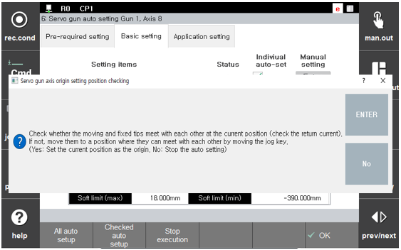
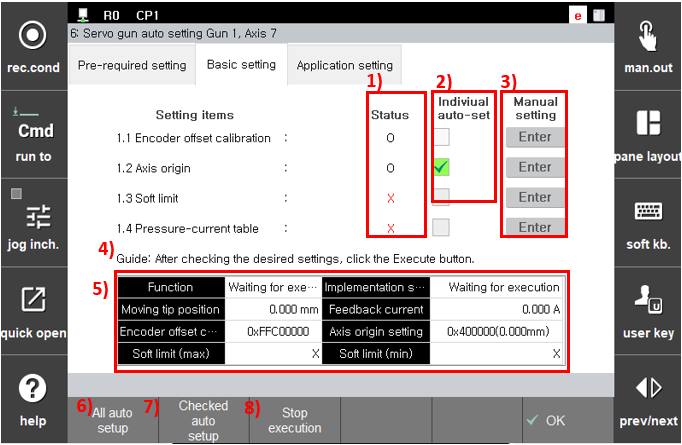

### 2.3.1 自动设置

通过按下 `[All auto setup]` 按钮来进展伺服枪默认设置的自动设置。伺服枪的移动电极自动移动时，必须满足以下条件。

* 附有新类型的移动电极和固定电极
* 伺服枪周围没有工人
* 移动电极与固定电极之间没有工件
* 手动模式
* 电动机开启
* 禁止移动电极的最大开启（与最大开启位置有一定距离的间隙）

在 `[All auto setup]` 的情况下，以下流程将自动进行。

  *  (1) 编码器偏差补偿  
      - 移动电极移动到最大开启位置。  
      - 伺服枪在最大开启位置停止，然后执行编码器偏差补偿。
  *  (2) 轴原点设置
      - 伺服枪进行三次挤压操作和两次开启操作。
      - 在第三次挤压操作后，伺服枪移动到两个电极相遇的位置。
      - 与用户确认相关位置。
      - 执行轴原点的设置。
  *  (3) 软极限设置  
      - 在轴原点设置后将自动执行。
  *  (4) 挤压力 - 电流表设置 
      - 将自动切换到设置的菜单。

在伺服枪默认设置的自动设置情况下，伺服枪的 '**编码器偏差补偿**' 位置和 '**轴原点补偿**' 位置被自动识别，允许在相关位置进行 '**编码器偏差补偿**'、'**轴原点补偿**' 和 '**软极限设置**'。在伺服枪默认设置的自动设置中，'**挤压力 - 电流表设置**' 不会自动进行。有关设置，请参阅章节 [2.3.3 挤压力 - 电流表设置](./2-3-3-servo-gun-force-current-table-tuning/README.md)。

在 '**全自动设置**' 的情况下，伺服枪移动到轴原点的位置并与用户确认轴原点的位置。在此过程中，检查移动电极的位置和反馈电流（1A 或以下）。如果移动电极与固定电极略微接触，请按 '**Yes**' 继续设置。如果反馈电流过高或移动电极与固定电极没有接触，请使用 jog 键进行微调，然后按 'Yes'。如果您不想进行自动设置，请点击 '**No**' 结束设置。

 </img>
 <em>
图 2.6 与用户确认轴原点的位置
</em>


`警告 (Warning)` 如果伺服枪的最大开启位置上有非金属材料（如缓冲器）附着的限位器，可能难以估计最大开启位置。建议在移除限位器后进行设置。


伺服枪默认设置屏幕的配置和功能如下。

 </img>
 <em>
图 2.7 默认设置的配置
</em>

 

1. **状态**: 显示伺服枪当前的设置状态（X: 设置前，O: 完成或已更改）

2. **单独自动设置**: 仅支持自动设置选中的项目功能，而不是全部。按下 `[Checked auto setup]` 按钮将仅对选中的项目执行自动设置。

3. **手动设置**: 转到设置相关项目的屏幕。  
    - 编码器偏移补偿: 转到 `[F2: 系统] - 3: 机器人参数 - 4: 编码器偏移 ([F2: system] - 3: Robot parameter - 4: Encoder offset)` 的屏幕
    - 轴原点设置: 转到 `[F2: 系统] - 3: 机器人参数 - 2: 轴原点 ([F2: system] - 3: Robot parameter - 2: Axis origin)` 的屏幕
    - 软极限设置: 转到 `[F2: 系统] - 3: 机器人参数 - 3: 软极限 ([F2: system] - 3: Robot parameter - 3: Soft limit)` 的屏幕
    - 压力 - 当前表设置: 转到 `[F2: 系统] - 4: 应用参数 - 1: Spot welding- 7: Servo gun squeeze force tuning ([F2: system] - 4: Application parameter - 1: Spot welding- 7: Servo gun squeeze force tuning)` 的屏幕

4. **指南**: 表示设置的当前状态或在发生错误时的原因和措施。

5. **监控**: 表示设置的当前状态和伺服枪的位置、反馈电流、设置值等。

6. `[全部自动设置]`: 命令执行所有项目的全部自动设置

7. `[选中自动设置]`: 仅自动设置指定为单独自动设置项目的项目

8. **执行停止**: 停止正在进行的设置。