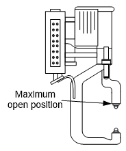
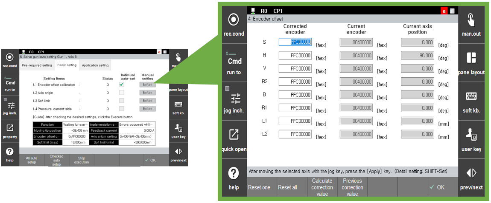

#### 2.3.2.1 伺服枪编码器偏移设置

通常，当因为更换伺服枪电机等原因更改编码器数据时，编码器的原点应设置在可以与相同机械位置匹配的位置。对伺服枪来说，设置应在机械上最大打开状态下进行。

伺服枪轴的编码器补偿程序如下。

(1) 手动释放伺服枪轴的刹车，然后将移动电极打开到最大位置。

 </img>
 <em>
图 2.8 伺服枪的最大开启位置
</em>

 

(2) 在 '**伺服枪自动设置**' 菜单的默认设置屏幕中，按下 '**编码器偏移补偿**' 菜单的 `手动设置 (Manual setting)` 按钮（图 2.9），或者使用光标在 `[F2: 系统] - 3: 机器人参数 - 4: 编码器偏移 ([F2: system] - 3: Robot parameter - 4: Encoder offset)` 中选择相关的伺服枪轴，然后按下 `[Reset]` 按钮。当当前编码器值变为 "**00400000**" 时，按下 `[F7: 确认] ([F7: OK])` 按钮。

 </img>
 <em>
图 2.9 转到编码器偏移补偿屏幕
</em>

