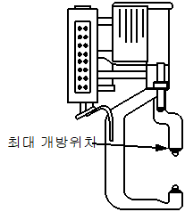

# 2.3.2.1 서보건 엔코더 옵셋 설정

통상적으로 엔코더의 원점은 서보건 모터의 교체 등으로 엔코더 데이터가 변경되었을 때 기구적으로 동일 위치를 일치시킬 수 있는 곳에서 설정을 합니다. 서보건의 경우 이동전극이 기구적으로 최대로 개방한 상태로 설정합니다.

서보건 축의 엔코더 보정 절차는 다음과 같습니다.

(1) 서보건 축의 브레이크를 수동으로 해제한 후, 이동전극을 최대로 개방합니다.

 </img>
 <em>
그림 2.8 서보건 최대 개방 위치
</em>

(2) ‘**서보건 자동 설정**’ 의 기본 설정 화면에서 ‘**엔코더 옵셋 보정**’의 [**수동 설정**] 버튼을 누르거나(그림 2.9), 『**설정**』 → 『**3: 로봇 파라미터**』 → 『**4: 엔코더 옵셋**』 에서 해당 서보건 축을 커서로 선택한 후, [**적용(Reset)**] 버튼을 누릅니다. 현재 엔코더 값이 “**00400000**”이 되면 [**완료(OK)**] 버튼을 입력합니다.

 </img>
 <em>
그림 2.9 엔코더 옵셋 보정 화면 이동
</em>

