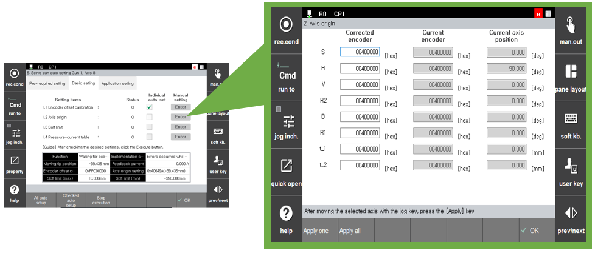

# 2.3.2.2 Servo gun axis origin

In general, the axis origin of the servo gun should be set at the position where both the moving and fixed electrodes, with a new tip attached individually, meet each other. As most operations of the servo gun are performed with this axis origin as the reference, it is very important to carry out setting for this.

The axis origin setting procedure for the axis of the servo gun is as follows.

1) Manually operate the axis of the servo gun to bring it into the state as shown in the figure below.

 </img>
 <em>
Figure 2.10 Position of the origin of the servo gun
</em>

1) In the default setting screen of the ‘**Servo gun automatic setting**’ menu, press the [**Manual setting**] button of the ‘**Axis origin setting**’ menu (figure below), or select the relevant axis of the servo gun in 『**Setting**』 → 『**3: Robot parameter**』 → 『**2: Axis origin**』 with the cursor and then press the \[**Reset**] button. When the current position of the axis is indicated as 0.0 mm, input by selecting the \[**OK**] button. 

 </img>
 <em>
Figure 2.11 Moving to the axis origin screen
</em>

