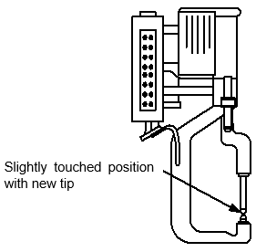
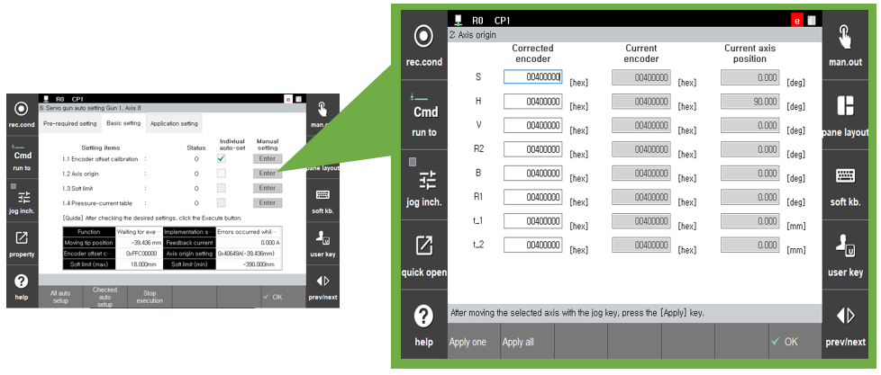

#### 2.3.2.2 伺服枪轴原点

一般来说，伺服枪的轴原点应该设置在移动电极和固定电极（分别附有新尖端）相互接触的位置。由于伺服枪的大多数操作是以该轴原点为参考进行的，因此进行设置是非常重要的。

伺服枪轴的原点设置程序如下。

1) 手动操作伺服枪的轴，使其达到下图所示的状态。

 </img>
 <em>
图 2.10 伺服枪原点的位置
</em>

1) 在 '**伺服枪自动设置**' 菜单的默认设置屏幕中，按下 '**轴原点设置**' 菜单的 `手动设置 (Manual setting)` 按钮（下图），或在 `[F2: 系统] - 3: 机器人参数 - 2: 轴原点 ([F2: system] - 3: Robot parameter - 2: Axis origin)` 中用光标选择相关的伺服枪轴，然后按下 `[Reset]` 按钮。当轴的当前位位置显示为 0.0 mm 时，通过选择 `[F7: 确定] ([F7: OK])` 按钮输入。

 </img>
 <em>
图 2.11 移动到轴原点屏幕
</em>

