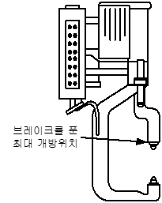
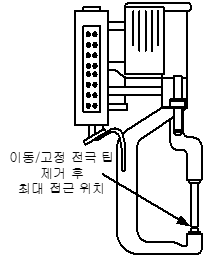
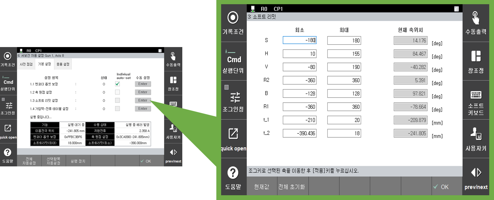

#### 2.3.2.3 서보건 소프트 리밋

통상적으로 서보건의 소프트 리밋은 이동전극이 최대로 개방한 상태에서 '최소'항목에 설정하며, 팁을 모두 제거한 가장 근접한 위치에서 '최대'항목에 설정합니다.

서보건축의 소프트 리밋 설정 절차는 다음과 같습니다.

1. 서보건을 수동으로 조작하여 아래 그림과 같은 상태가 되도록 합니다.

 </img>
 </img>
 <em>
그림 2.12 서보건 리밋 설정
</em>

2. '**서보건 자동 설정**'의 기본 설정 화면에서 '**소프트 리밋 설정**'의 `[Enter] + 아니오` 버튼을 눌러서 `3: 소프트 리밋` 화면에 진입하여 해당 서보건 축의 소프트 리밋값을 설정한 후, `[F7: 확인]` 버튼을 입력합니다.

 </img>
 <em>
그림 2.13 서보건 리밋 설정 화면 이동
</em>

