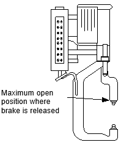
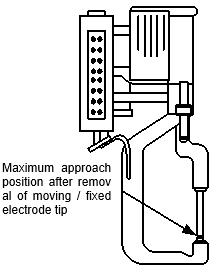
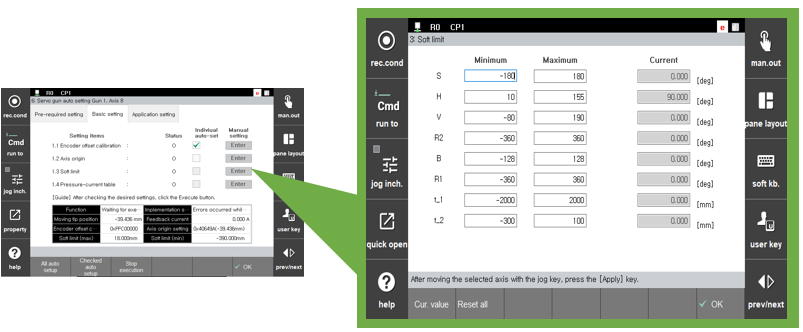

#### 2.3.2.3 伺服枪软极限

一般来说，伺服枪的软极限应该在移动电极完全打开时设置为“最小”，在移动电极与所有尖端移除后处于最接近位置时设置为“最大”。

伺服枪轴的软极限设置程序。

1. 手动操作伺服枪，使其达到如下图所示的条件

 </img>
 </img>
 <em>
图 2.12 伺服枪软极限设置
</em>

 

2. 在“**伺服枪自动设置**”菜单的默认设置屏幕中，按下“**软极限设置**”菜单的 `[Manual setting]` 按钮（如下图所示），或使用光标在 `[F2: 系统] - 3: 机器人参数 - 3: 软极限 ([F2: system] - 3: Robot parameter - 3: Soft limit)` 中选择相关的伺服枪轴，然后按下 `[Reset]` 按钮。如果指示正常进行，通过选择 `[F7: 确认] ([F7: OK])` 按钮输入。 

 </img>
 <em>
图 2.13 移动到伺服枪软极限设置屏幕
</em>

