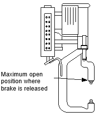

# 2.3.2.3 Servo gun soft limit

In general, the soft limit of the servo gun should be set to 'Minimum' while the moving electrode is fully open, and set to 'Maximum' while the moving electrode is at the closest position with all tips removed.

The soft limit setting procedure for the axis of the servo gun.

1. Manually operate the servo gun to bring it to the condition as shown in the figure below

 </img>
 </img>
 <em>
Figure 2.12 Setting of the servo gun soft limit
</em>

2. In the default setting screen of the ‘**Servo gun automatic setting**’ menu, press the [**Manual setting**] button of the ‘**Soft limit setting**’ menu (Figure below), or select the relevant axis of the servo gun in 『**Setting**』 → 『**3: Robot parameter**』 → 『**3: Soft limit**』 with the cursor and then press the \[**Reset**] button. If the indication is performed normally, input by selecting the \[**OK**] button.

 </img>
 <em>
Figure 2.13 Moving to the servo gun soft limit setting screen 
</em>

