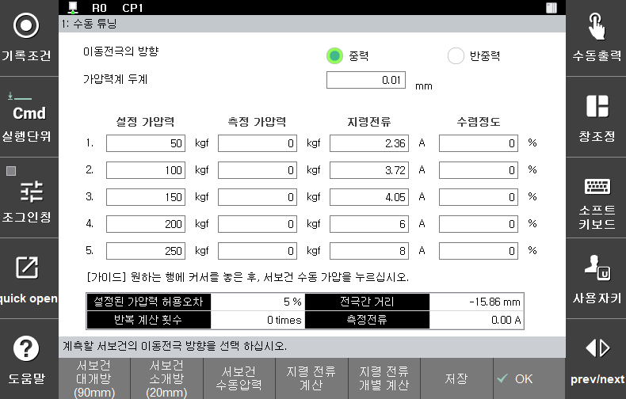

# 2.3.3.1 수동 튜닝 모드

수동 튜닝 모드는 서보건 가압력 –전류테이블 설정을 수동으로 수행할 때 사용하는 기능입니다. 서보건 가압 후 측정된 가압력을 사용자가 직접 티칭 펜던트를 이용하여 입력하면 자동으로 최적의 지령전류를 계산합니다. 이 과정을 반복적으로 수행하여 정확도를 높여야 하며 정확도는 수렴 정도 및 테스트 가압으로 확인할 수 있습니다.

당사에서 권장하는 수동 모드 서보건 가압력 - 전류테이블 설정 절차는 아래와 같습니다.

 </img>
 <em>
그림 2.14 서보건 수동 튜닝 화면
</em>

 

>1. 튜닝을 원하는 이동전극 방향을 설정(중력 또는 반중력)
>2. \[**Shift**] + \[**서보건 수동압력**] 또는 서보건 축 조그로 이동전극이 가압력계에 맞닿는 위치로 이동하여 가압력계 두께 측정(전극간 거리)
>3. 측정한 두께를 화면 상단 가압력계 두께에 입력
>4. 설정하고자 하는 가압력의 대푯 값을‘**설정 가압력**’에 입력
>5. 가압하고자 하는 설정 가압력 행에서 서보건 가압 (아래 그림에서는 현재 녹색 포커스가 있는 100 kgf로 가압함. svgun man press: \[**Ctrl**]/\[**Shift**] + \[**서보건 수동압력**])
>6. 가압력계로 측정된 가압력을 ‘**측정 가압력**’에 기입
>7. 모든 설정 가압력에 대해 3 \~ 6과정을 반복
>8. 입력 완료 후 \[**지령전류 계산**]을 눌러 설정 가압력에 맞는 지령 전류 계산
>9. 수렴 정도를 확인 및 테스트 가압으로 지령 전류의 반복 계산이 필요한 경우 3 \~ 8 과정을 반복
>10. 특정 가압력의 지령 전류만 계산하기 원하는 경우 측정 가압력 입력 후 \[**지령전류 개별 계산**]을 실행
>11. \[**저장하기**]를 눌러 현재 설정 저장 후 이동 전극 방향 변경 후 1 \~ 8 과정을 반복

 

서보건 가압을 위해서는 \[**Shift**] + \[**서보건 수동압력**] 또는 \[**Ctrl**] + \[**서보건 수동압력**]을 눌러야 합니다. \[**Ctrl**] + \[**서보건 수동압력**]이 자동모드와 동일한 제어를 하기 때문에 \[**Ctrl**] + \[**서보건 수동압력**]의 사용을 권장합니다.

아래 그림은 ‘지령 전류 계산’을 2회 수행한 후의 화면입니다. 수렴 정도가 충분히 낮은 경우 설정 가압력으로 가압하여 측정된 가압력과 차이를 확인 후 계속 진행 여부를 결정하십시오.

지령 전류 계산을 위해 1개 이상의 측정 가압력을 입력해야 합니다. 초기 지령 전류가 서보건으로 가압 가능한 범위를 벗어난 경우 1 \~ 2개의 측정 가압력만을 입력 후 ‘지령 전류 계산’을 수행하여 초기 값을 다시 설정할 수 있습니다. 측정 가압력을 모두 입력하지 않고 지령 전류 계산을 수행하면 전반적인 정확도는 낮아지므로 초기 지령 전류 재설정하는 경우 이외에는 측정 가압력을 모두 입력 후 ‘지령 전류 계산’ 수행을 권장합니다.

설정 항목에 대한 설명은 아래와 같습니다.

*   **이동 전극의 방향**

    현재 튜닝 중이 서보건의 이동전극 방향으로 중력 방향과 반중력 방향을 각각 1회씩 설정해야 합니다.
*   **설정 가압력**

    사용하고자 하는 가압력의 대푯값으로 튜닝을 통해 설정 가압력과 대응되는 지령전류를 찾습니다.
*   **측정 가압력**

    현재 지령 전류로 가압했을 때 측정된 가압력으로 사용자가 가압력계를 이용하여 직접 입력해야 합니다.
*   **지령 전류**

    현재 설정 가압력과 대응되는 지령 전류로 계산을 통해 갱신됩니다.
*   **수렴 정도**

    전류 계산 후 이전 지령전류 대비 계산된 지령전류의 변화량으로 이 값이 낮을수록 가압력 튜닝의 정확도가 높습니다.
*   **설정된 가압력 허용오차**

    서보건 파라미터 중 가압력 허용오차로 테스트 가압 후 현재 상태를 점검하는데 사용될 수 있습니다.
*   **전극간 거리**

    서보건의 전극간 거리를 모니터링 할 수 있습니다. (가압과 개방 상태 모니터링 가능)
*   **반복 계산 횟수**

    지금까지 ‘지령 전류 계산’을 눌러 지령 전류를 갱신한 횟수 입니다. 수차례 반복 후에도 수렴 정도가 줄어들지 않는다면 ‘지령 전류 개별 계산’을 사용하거나 가압력계와 서보건 상태를 점검하십시오.
*   **측정 전류**

    현재 측정된 전류로 가압 시 지령 전류에 근접하게 모니터링 됩니다.


\[**Ctrl**] + \[**서보건 수동압력**]은 1회 실행으로 가압 완료까지 동작하여, 중간에 버튼을 떼서 멈출 수 없습니다. 그러므로 가압 동작의 정지를 위해서는 인에이블 스위치를 놓거나, 비상정지 버튼을 누르십시오.또한 가압력계 두께가 실제와 다른 경우 자동 모드에서 가압력이 달라질 수 있으므로 정확한 값을 입력하십시오.

현재 화면 오른쪽의 기능 버튼들로 서보건 설정과 동작이 가능하고 설정과 동작은 아래와 같습니다.

* \[**Shift**] + \[**서보건 대개방**]: 서보건 대개방(표시된 개방거리만큼 개방)
* \[**Shift**] + \[**서보건 소개방**]: 서보건 소개방(표시된 개방거리만큼 개방)
* \[**Shift**] + \[**서보건 수동압력**]: 서보건 가압(현재 커서가 위치한 가압력으로 가압)
* \[**Ctrl**] + \[**서보건 대개방**]: 서보건 대개방 거리 설정
* \[**Ctrl**] + \[**서보건 소개방**]: 서보건 소개방 거리 설정
* \[**Ctrl**] + \[**서보건 수동압력**]: 서보건 가압(현재 커서가 위치한 가압력으로 가압, 자동모드와 동일 제어)
