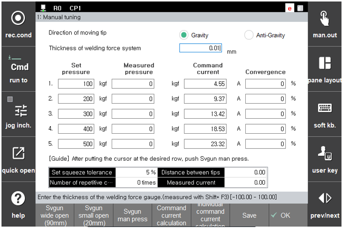

#### 2.3.3.1 手动调节模式

手动调节模式是一个功能，用于手动执行伺服枪挤压力 - 电流表设置。在伺服枪挤压之后，如果用户通过教导 pendant 直接输入测量到的挤压力，将自动计算出最优指令电流。这个过程应重复进行，以提高准确性。准确性可以通过收敛程度和测试挤压来验证。

在手动模式下，设置伺服枪挤压力 - 电流表的步骤，由我公司推荐如下。

 </img>
 <em>
图 2.14 伺服枪手动调节屏幕
</em>

 

1. 设置需要调节的移动电极的方向（重力或反重力）。

2. 按下 `[SHIFT]` 键 + `[Servo gun manual pressure]` 按钮，或通过移动伺服枪的轴，将移动电极移到可以接触挤压力计的位置，然后测量挤压力计的厚度（电极之间的距离）。

3. 输入测量到的厚度到屏幕上方所示的挤压力计厚度部分（电极之间的距离）。

4. 输入您要设置的目标挤压力的代表值到 '**设置挤压力**' 部分。

5. 根据指示您想要执行挤压的设定挤压力的线来挤压伺服枪。（在下面的图中，挤压是用当前指示为绿色焦点的100 kfg进行的。 svgun man press: `[CTRL]`, `[SHIFT]` + `[Servo gun manual pressure]`）

6. 将通过挤压力计测得的挤压力输入到 '**测量的挤压力**' 部分。

7. 对所有设定的挤压力重复步骤 3-6。

8. 完成输入后，按下 `[指令电流计算]` 按钮，以计算与设定挤压力相匹配的指令电流。

9. 如有必要检查收敛程度并通过测试挤压进行重复计算指令电流，重复步骤 3-8。

10. 如果您只想计算特定挤压力的指令电流，请输入测得的挤压力，然后执行 `[指令电流单独计算]` 过程。

11. 通过按下 `[保存]` 保存当前设置。之后，改变移动电极的方向，然后重复以上步骤 1-8。

 

要挤压伺服枪，您应该按下 `[SHIFT]` + `[Servo gun manual pressure]` 或 `[CTRL]` + `[Servo gun manual pressure]`。考虑到使用 `[CTRL]` + `[Servo gun manual pressure]` 时，您可以以与自动模式相同的方式执行控制，建议使用 `[CTRL]` + `[Servo gun manual pressure]`。

下图是执行 `[指令电流计算]` 两次后的状态屏幕。如果收敛程度足够低，需要使用设定的挤压力进行挤压并检查与测量压力的差异，然后决定是否继续。

至少需要输入一个测量的挤压力以进行指令电流计算。如果初始指令电流超过伺服枪能够执行挤压的范围，您可以通过只输入一到两个测得的挤压力，然后执行 '指令电流计算' 来重置初始值。如果在未输入所有测量挤压力的情况下进行指令电流计算，整体准确性将降低。考虑到这一点，建议在输入所有测量挤压力后进行 '指令电流计算'，除非重置初始指令电流的情况。

设定项的解释如下。

*   **移动电极的方向**

    这是当前正在调节的伺服枪移动电极的方向。每种方向应分别设置一次，包括重力方向和反重力方向。
*   **设置挤压力**

    这是要使用的挤压力的代表值。用于找到对应于设定挤压力的指令电流。
*   **测量的挤压力**

    这是在执行当前命令电流时测量的挤压力。用户应通过使用挤压力计直接输入该值。
*   **命令电流**

    这是与当前设置的挤压力相对应的命令电流。
*   **收敛度**

    此值是当前计算完成后，计算的命令电流与之前命令电流的变化量。此值越低，挤压力的调节精度越高。
*   **设定挤压力的允许误差**

    这是伺服枪参数中的挤压力允许误差，可用于检查测试挤压后的当前状态。
*   **电极之间的距离**

    这使您能够监控伺服枪电极之间的距离（可以监控挤压和打开的状态）。
*   **重复计算的次数**

    这是迄今为止通过按下`[命令电流计算]`按钮更新命令电流的次数。如果收敛度在几次重复后没有降低，请使用`[命令电流单独计算]`按钮或检查挤压力计和伺服枪的状态。
*   **测量的电流**

    这是当前测量的电流，并将在执行挤压时以接近命令电流的方式进行监测。

 

  
通过选择`[CTRL]`键 + `[伺服枪手动压力]`按钮进行的操作将在一次执行中一直工作到挤压完成，在中途释放按钮会使操作无法停止。因此，要停止挤压操作，必须释放使能开关或按下紧急停止按钮。此外，如果挤压力计的厚度与实际值不同，则在自动模式下挤压力也会不同。因此，请输入正确的值。

您可以使用当前屏幕右侧的功能按钮设置和操作伺服枪。相关设置和操作如下。

* `[SHIFT]` + `[伺服枪宽开口]`：宽幅打开伺服枪（按指定的打开距离）。
* `[SHIFT]` + `[伺服枪窄开口]`：窄幅打开伺服枪（按指定的打开距离）。
* `[SHIFT]` + `[伺服枪手动压力]`：在当前光标位置使用挤压力挤压伺服枪。
* `[CTRL]` + `[伺服枪宽开口]`：设定伺服枪宽开口的距离。
* `[CTRL]` + `[伺服枪窄开口]`：设定伺服枪窄开口的距离。
* `[CTRL]` + `[伺服枪手动压力]`：在当前光标位置使用挤压力挤压伺服枪，并应用与自动模式相同的控制。

