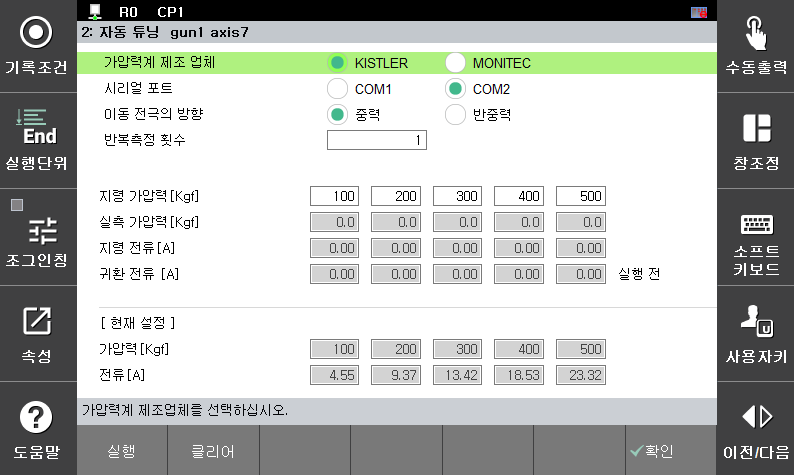

# 2.3.3.2 자동 튜닝 모드

서보건 가압력 –전류테이블 설정을 자동으로 수행할 때 사용하는 기능으로 가압력계와 로봇 제어기 사이에 데이터 전송이 가능해야 합니다. 사용하고자 하는 가압력계의 지원 여부를 반드시 문의하시기 바랍니다.

 </img>
 <em>
그림 2.14_1 서보건 자동 튜닝 화면
</em>

 
 

기능을 사용하기 전 위 그림과 같이 고정전극 상부에 가압력계를 위치하고 이동전극을 조작하여 가압력계와 접촉시킵니다. 그 후 서보건 가압력 - 전류 테이블 자동 튜닝 설정 화면으로 진입 하고 [실행] 버튼을 눌러 튜닝을 진행 시킵니다. 자동 튜닝 도중 이동 전극이 여러 차례 반복이동하기 때문에 수동모드의 모터 온 상태에서 진행을 시켜야 합니다. (모터 오프 시 진행 중단) 진행 도중 튜닝을 강제로 종료하고자 하는 경우 [클리어] 버튼을 누르면 됩니다. 튜닝 완료 후 가압력 별로 테스트 가압하여 정확도에 이상이 있는 경우 반복 수행하시기 바랍니다.

설정 항목에 대한 설명은 아래와 같습니다.

*   **가압력계 제조업체**

    사용하는 가압력계를 선택합니다.
*   **시리얼 포트**

    접속한 시리얼 포트의 번호를 선택합니다.
*   **이동 전극의 방향**

    서보건 이동전극의 진행방향이 중력 방향인지 반중력 방향인지 선택합니다. 
*   **반복측정 횟수**
  
    지령 전류의 편차를 줄이기 위해 자동 튜닝의 반복 횟수를 설정합니다. (1~10)
    현재 설정 가압력과 대응되는 지령 전류로 계산을 통해 갱신됩니다.
*   **지령 가압력**

    원하는 범위의 가압력 테이블을 5단계로 설정합니다.