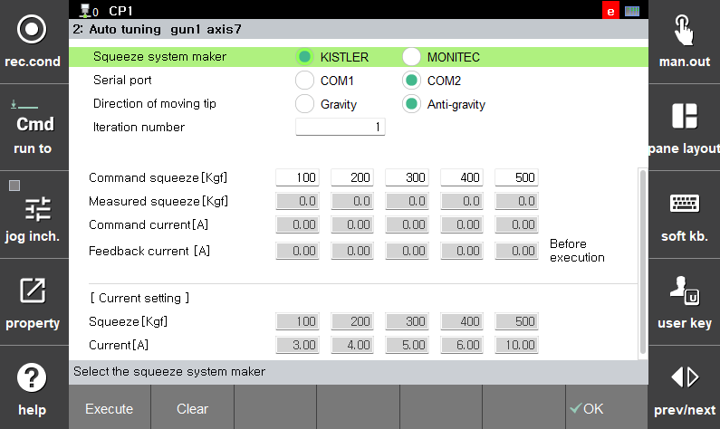

#### 2.3.3.2 自动调谐模式

此功能用于自动设置伺服枪挤压力-电流表。
要使用此功能，挤压力计与机器人控制器之间的数据通信必须可用。在使用前请确保选定的挤压力计被支持。

 </img>
 <em>
图 2.14-1 伺服枪自动调谐屏幕
</em>

 

在使用此功能之前，请将挤压力计放置在固定电极的顶部，如上图所示，并手动移动移动电极使其与计量器接触。

然后，进入伺服枪挤压力-电流表自动调谐设置屏幕，并按下`[Execute]`按钮以开始调谐。

在自动调谐期间，移动电极会重复移动几次。因此，该过程必须在手动模式下进行，并且电机必须处于开启状态。(如果电机关闭，过程将停止。)

如果在操作期间需要强制停止调谐，请按下`[Clear]`按钮。在完成调谐后，对每个力级进行测试挤压。如果存在任何准确性问题，请重复调谐过程。

 

设置如下所述：

 - 挤压系统制造商  
选择将要使用的挤压力计的制造商。

 - 串口  
选择连接的串口编号。

 - 移动尖端方向  
选择伺服枪电极的移动方向是沿重力方向还是反重力方向。

 - 迭代次数  
设置自动调谐的重复次数以减少指令电流的变化。(1-10)

 - 指令挤压[kgf]  
为表格设置所需的挤压力范围，共五个级别。