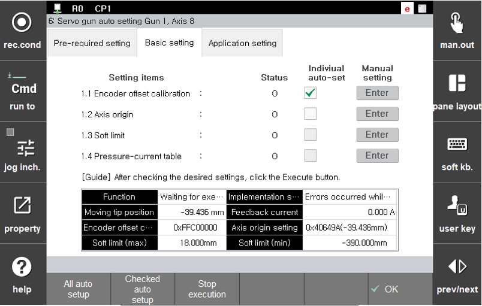

# 2.3 Step 1. Default setting

After the pre-inspection is completed, the default setting can be performed. The default setting is an essential setting process to determine the reference position of the moving electrode of the servo gun, move the servo gun to a desired position, and supply the desired squeezing force.

The default setting consists of four items as shown in the figure below.

 </img>
 <em>
Figure 2.5 Default setting proceeding screen
</em>

 

(1) **Encoder offset compensation**
   * Normally, when the encoder data is changed because of replacement of the servo gun motor, etc., the origin of the encoder should be set at a position that can have the same mechanical position. In the case of the servo gun, the setting should be performed with the moving electrode in the mechanically maximum open state.
   * For manual setting, refer to “[**2.3.2.1 Servo gun encoder offset setting**](2-3-2-manual-setting/1-servo-gun-encoder-offset-setting.md)” of “[**2.3.2** **Manual setting**](2-3-2-manual-setting/).”
  
(2) **Axis origing setting**
   * In general, the setting of the axis origin of the servo gun should be performed at the position where both the moving and fixed electrodes, with a new tip attached individually, meet each other. As most operations of the servo gun are performed with this axis origin as the reference, it is very important to carry out setting for this.
   * For manual setting, refer to “[**2.3.2.2 Servo gun axis origin**](2-3-2-manual-setting/2-servo-gun-axis-origin.md)” of “[**2.3.2** **Manual setting**](2-3-2-manual-setting/).”
   
  
(3) **Soft limit setting**
   * In general, the soft limit of the servo gun should be set to ‘**Minimum**’ while the moving electrode is fully open, and set to ‘**Maximum**’ while the moving electrode is at the closest position with all tips removed.
   * For manual setting, refer to “[**2.3.2.3 Servo gun soft limit**](2-3-2-manual-setting/3-servo-gun-soft-limit.md)” of “[**2.3.2** **Manual setting**](2-3-2-manual-setting/).”
    
(4) **Squeezing force - current table setting**
   * To squeeze the various servo guns, which are to be installed to the robot, with the desired squeezing force, it is necessary to make the current supplied to the servo gun correspond to the generated squeezing force. For this, our company provides a servo gun squeezing force - current table. It is necessary to tune this table to match with the servo gun..
   * To use this function, it is necessary to select five representative values among the areas of the squeezing force to be used. Tuning the servo gun squeezing force - current table is a process to find the currents that match with these five representative squeezing forces. This table can vary depending on the posture of the servo gun, so it is necessary to perform tuning for each case of when the direction of the moving electrode is in the direction of gravity and when it is in direction of anti-gravity, and, through this method, squeezing can be performed with high accuracy in various postures of the servo gun.
   * For more details, refer to “[**Servo gun squeezing force - current table tunning**](2-3-3-servo-gun-force-current-table-tuning/).”

 

The default setting can be performed with automatic settng and manual setting.

(1) **Automatic setting**: The servo gun automatically moves to the designated position and then perform the designated setting.
   * Items that can be automatically set
     * Encoder offset compensation
     * Axis origin setting
     * Soft limit setting
   * The setting of the squeezing force - current table cann not be automatically performed because it requires user intervention such as the installation of a squeezing force gauge.
   
(2) **Manual setting**: The servo gun needs to be moved to the designated position through the operation by the user and the designated function will be performed on the dedicated setting screen.
