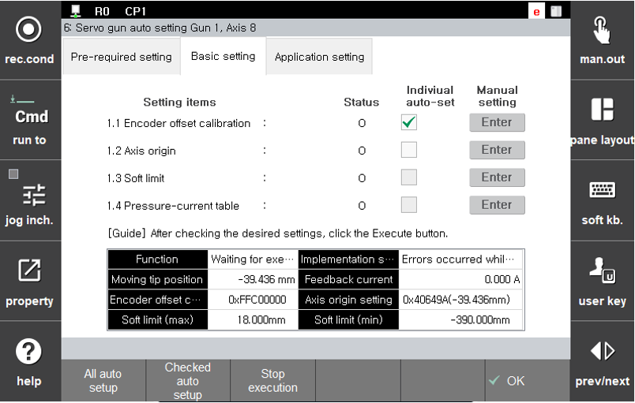

# 2.3 第一步。默认设置

在完成预检查后，可以执行默认设置。默认设置是一个基本设置过程，用于确定伺服枪活动电极的参考位置，将伺服枪移动到所需位置，并提供所需的夹紧力。

默认设置包括如下四项，如下图所示。

 </img>
 <em>
图2.5 默认设置进行屏幕
</em>

 

(1) **编码器偏移补偿**
   * 通常，当因为更换伺服枪电机等原因导致编码器数据变化时，编码器的原点应设置在可以具有相同机械位置的位置。在伺服枪的情况下，设置应在机械最大打开状态下的移动电极处进行。
   * 有关手动设置，请参考章节 [2.3.2.1 伺服枪编码器偏移设置](2-3-2-manual-setting/1-servo-gun-encoder-offset-setting.md)。
  
(2) **轴原点设置**
   * 一般而言，伺服枪的轴原点设置应在新尖端单独附加的移动电极和固定电极相遇的位置进行。由于伺服枪的大多数操作是以此轴原点为参考，因此进行此设置非常重要。
   * 有关手动设置，请参考章节 [2.3.2.2 伺服枪轴原点](2-3-2-manual-setting/2-servo-gun-axis-origin.md)。
   
  
(3) **软限制设置**
   * 通常，伺服枪的软限制应在移动电极完全打开时设置为 '**最小**'，并在移动电极在所有尖端移除后处于最近位置时设置为 '**最大**'。
   * 有关手动设置，请参考章节 [2.3.2.3 伺服枪软限制](2-3-2-manual-setting/3-servo-gun-soft-limit.md)。
    
(4) **夹紧力 - 电流表设置**
   * 为了以所需的夹紧力夹紧要安装到机器人的各种伺服枪，需要使提供给伺服枪的电流与产生的夹紧力相对应。为此，我公司提供了伺服枪夹紧力 - 电流表。需要对该表进行调试以与伺服枪匹配。
   * 要使用此功能，需要在要使用的夹紧力区域中选择五个代表值。调试伺服枪夹紧力 - 电流表是一个寻找与这五个代表夹紧力相匹配的电流的过程。此表可能会因伺服枪的姿势而有所不同，因此，在移动电极方向为重力方向和反重力方向时，每种情况都需要进行调试，通过这种方法，可以在伺服枪的各种姿势中以高精度进行夹紧。
   * 有关更多详细信息，请参考章节 [2.3.3 伺服枪夹紧力 - 电流表调试](2-3-3-servo-gun-force-current-table-tuning/README.md)。

 

默认设置可以通过自动设置和手动设置进行。

(1) **自动设置**：伺服枪自动移至指定位置，然后执行指定设置。
   * 可以自动设置的项目
     * 编码器偏移补偿
     * 轴原点设置
     * 软限制设置
   * 夹紧力 - 电流表的设置无法自动执行，因为它需要用户干预，例如安装夹紧力计。
   
(2) **手动设置**：用户需要通过操作将伺服枪移动到指定位置，并在专用设置屏幕上执行指定功能。