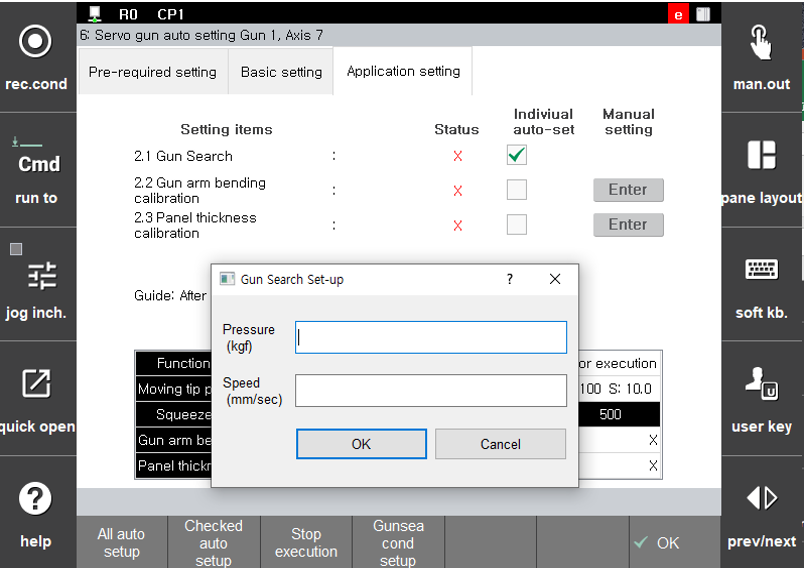
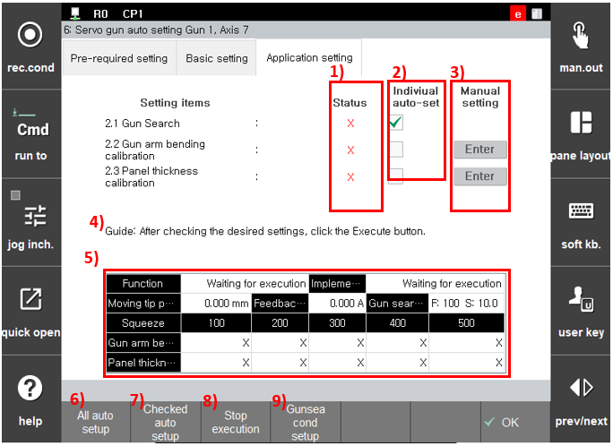

### 2.4.1 自动设置

通过按 `[All auto setup]` 按钮，推进伺服枪应用设置的自动设置。伺服枪的移动电极会自动移动。此外，设置值受挤压力影响，因此必须满足以下条件。

* 附有新类型的移动和固定电极
* 伺服枪周围没有工人
* 移动电极与固定电极之间没有工件
* 手动模式
* 电机开启
* 完成伺服枪的默认设置（步骤 1）

在 `[All auto setup]` 的情况下，以下程序将自动进行。

1. 枪搜索
   * 在伺服枪进行两次挤压时执行枪搜索。
   * 第一次：'枪搜索参考位置记录' 有效
   * 第二次：'枪搜索参考位置记录' 无效
2. 枪臂偏转量补偿
   * 在伺服枪进行五次挤压时执行枪臂偏转量补偿。
3. 面板厚度测量补偿  
   * 在伺服枪进行五次挤压时执行面板厚度测量补偿。


通过 '**自动设置**' 进行的枪搜索仅适用于枪搜索 1。当使用枪搜索 1 以外的其他枪搜索时，应参考 [4.1 Gun search](../../4-work-teaching/4-1-gun-search/README.md)。  


在“全部自动设置”的情况下，“枪臂偏转量补偿”和“面板厚度测量补偿”将同时进行，因此伺服枪仅进行五次挤压。在执行“枪搜索”时，应该指定挤压力和枪搜索速度。如果按下 `[Gunsea cond setup]` 按钮，可以设置在枪搜索过程中将使用的挤压力和移动速度，如下图所示。

 </img>
 <em>
图 2.16 枪搜索条件设置屏幕
</em>


在 '**枪臂偏转补偿**' 和 '**面板厚度测量补偿**' 的情况下，手动测量和填写值比较困难，因此建议使用自动设置。

“枪臂偏转量补偿”值是在伺服枪参数中代替“枪臂偏转量/100 kgf\[mm]”使用的值。当设置“枪臂偏转量补偿”值时，已设置的“枪臂偏转量/100 kgf\[mm]”将不再使用。相反，如果未设置“枪臂偏转量补偿”值，则将使用“枪臂偏转量/100 kgf\[mm]”。


伺服枪应用设置屏幕的配置和功能如下。

 </img>
 <em>
图 2.17 伺服枪应用设置屏幕
</em>

 

1. **状态**：显示伺服枪的当前设置状态（设置前、完成或已更改）。

2. **个别自动设置**：支持仅对选中的项目进行自动设置的功能，而不是全部。按下 `[Checked auto setup]` 按钮可以仅对选中的项目进行自动设置。

3. **手动设置**：转到设置相关项目的屏幕
     *   枪臂偏转量补偿  
         自动转到 `[F2: 系统] - 4: 应用参数 - 1: 点焊焊接中 - 3: 焊枪参数 ([F2: system] - 4: Application parameter - 1: Spot welding - 3: Welding gun parameter)` 的屏幕
     *   面板厚度测量补偿  
         自动转到 `[F2: 系统] - 4: 应用参数 - 1: 点焊焊接中 - 3: 焊枪参数 ([F2: system] - 4: Application parameter - 1: Spot welding - 3: Welding gun parameter)` 的屏幕

4. **指南**：指示设置的当前状态或发生错误时的原因和措施。

5. **监控**：指示设置的当前状态和伺服枪的位置、反馈电流、设定值等。

6. `[All auto setup]`：命令执行所有项目的全部自动设置。

7. `[Checked auto setup]`：仅自动设置指定为个别自动设置项目的项目。

8. **执行停止**：停止正在进行的设置。

9. **枪搜索条件设置**：设置枪搜索的速度和挤压力。