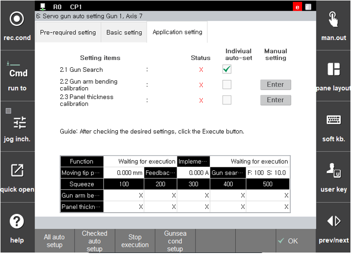

# 2.4 Step 2. Application setting

When the default setting is completed, the application setting can be performed. The application setting is the item that can be performed after the ‘**squeezing force - current table tuning**.’ It consists of a procedure for setting the reference position for the gun search, a procedure for estimating the amount of the servo gun arm deflection during the squeeze operation, and a compensation procedure for accurate measurement of the panel thickness.

The application setting consists of three items as shown in the figure below.

 </img>
 <em>
Figure 2.15 Servo gun application setting screen
</em>

>1. **Gun search**
>     * Sets the reference position for measuring the consumption amount of the tip and checks the consumption amount once.
>     * For manual setting, refer to “[**4.1 Gun search**](../../4-work-teaching/4-1-gun-search/).”
>2. **Gun arm deflection amount compensation**
>      * The gun arm deflection amount compensation should be set to compensate for the gun arm deflection that occurs when the servo gun performs squeezing. Sets the deflection amount according to the squeeze force set in the squeezing force – current table.
>      * For manual setting, press the Manual setting key in the figure above, or, in the screen of『**Setting**』 → 『**4: Application parameter**』 → 『**1: Spot welding**』 → 『**3: Weldin gun parameter**』, set the gun number that needs to be set and then press 『**Application condition**』 to enter.
>3. **Panel thickness measurement compensation**
>      * The panel thickness measurement compensation is a setting to improve the accuracy of the panel thickness measured with the ThickCheck command.
>     * For manual setting, press the Manual setting button in the figure above, or, in the screen of『**Setting**』 → 『**4: Application parameter**』 → 『**1: Spot welding**』 → 『**3: Welding gun parameter**』, set the gun number that needs to be set and the press the 『**Application condition**』 key to enter.

Among the application setting items, the ‘gun search’ setting is essential. If ‘gun search’ is not set, it is impossible to execute and teach commands related to spot welding (for example, spot gn=1,…). On the other hand, '**gun arm deflection amount compensation**' and '**panel thickness measurement compensation**' has nothing to do with the execution and teaching of commands related to spot welding, but are necessary settings for accurate operation and accurate panel thickness measurement.

The application setting can be progressed in automatic setting and manual setting.

   (1) **Automatic setting**  
   * The servo gun automatically moves to execute ‘**gun search**’, ‘**gun arm deflection amount compensation**’ and ‘**panel thickness measurement compensation**’. All items of the application setting can be performed automatically.  
  
   (2) **Manual setting**  
   * The user directly performs ‘**gun search**’ and inputs the ‘**gun arm deflection amount compensation**’ and ‘**panel thickness measurement compensation**’ values.  
