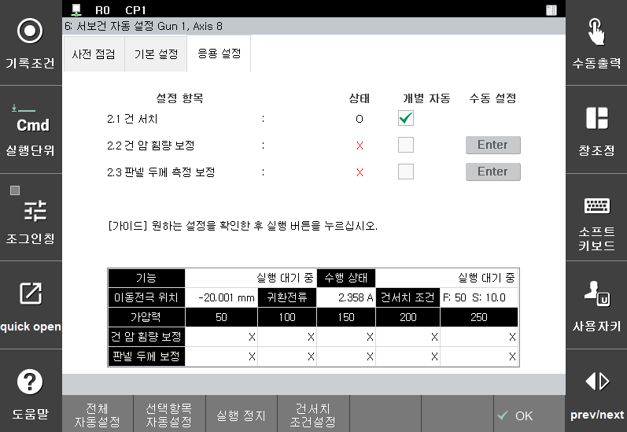

# 2.4 Step 2. 응용 설정

기본 설정이 완료되면 응용 설정이 가능합니다. 응용 설정은 ‘**가압력-전류 테이블 튜닝**’ 후에 설정이 가능한 항목으로, 건 서치의 기준 위치를 정하고, 가압 시 서보건 암의 휨량을 추정하고, 정확한 판넬 두께 측정하기 위한 보정 절차로 이루어져 있습니다.

응용 설정은 아래 그림과 같이 3가지 항목으로 구성되어 있습니다.

 </img>
 <em>
그림 2.15 서보건 응용 설정 화면
</em>

>1. **건 서치**
>     * 팁의 마모량 측정을 위해 기준이 되는 위치를 설정하고, 마모량 체크를 1회 합니다.
>     * 수동 설정을 위해서는 “[**4.1 건서치**](../../4-work-teaching/4-1-gun-search/)” 챕터를 참고하십시오.
>2. **건 암 휨량 보정**
>      * 건 암 휨량 보정은 서보건 가압 시 건 암이 휘는 정도를 보정하기 위해 설정이 필요합니다. 가압력-전류 테이블에 설정된 가압력에 따른 휨량을 설정합니다.
>      * 수동 설정을 위해서는 위 그림의 수동설정 버튼을 누르거나, 『**설정**』 → 『**4: 응용 파라미터**』 → 『**1: 스폿용접**』 → 『**3: 용접건 파라미터**』에서 설정하고자 하는 건 번호 선택 후 『**응용 조건**』을 눌러 진입합니다.
>3. **판넬 두께 측정 보정**
>      * 판넬 두께 측정 보정은 ThickCheck 명령어로 측정된 판넬의 두께 정밀도를 향상 시키기 위한 설정입니다.
>     * 수동 설정을 위해서는 위 그림의 수동설정 버튼을 누르거나, 『**설정**』 → 『**4: 응용 파라미터**』 → 『**1: 스폿용접**』 → 『**3: 용접건 파라미터**』에서 설정하고자 하는 건 번호 선택 후 『**응용 조건**』을 눌러 진입합니다.

응용 설정 중 ‘건서치’ 설정은 필수 설정으로 ‘건서치’설정이 되어 있지 않으면 스폿 용접 관련된 명령어 실행 및 교시가 불가합니다.(예, spot gn=1,…) 반면, ‘**건 암 휨량 보정**’과 ‘**판넬 두께 측정 보정**’은 스폿 용접 관련 명령어 실행 및 교시와는 무관하지만 정확한 동작 및 판넬 두께 측정을 위해 필요한 설정입니다.

응용 설정은 자동 설정과 수동 설정으로 진행할 수 있습니다.

   (1) **자동 설정**  
   * 서보건이 자동으로 움직여 ‘**건서치**’, ‘**건 암 휨량 보정**’ 과 ‘**판넬 두께 측정 보정**’을 실행합니다. 응용 설정의 전 항목이 자동으로 설정 가능합니다.  
  
   (2) **수동 설정**  
   * 사용자가 직접 ‘**건서치**’를 수행하고, ‘**건 암 휨량 보정**’ 과 ‘**판넬 두께 측정 보정**’값을 기입합니다.  
