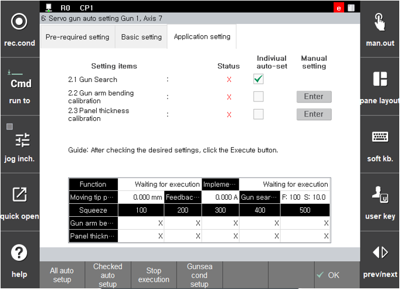

# 2.4 第 2 步. 应用设置

完成默认设置后，可以进行应用设置。应用设置是在 **挤压力 - 电流表调谐** 之后可以执行的项目。它包括设置枪搜索的参考位置、估计挤压操作期间伺服枪臂偏转量的程序，以及用于准确测量面板厚度的补偿程序。

应用设置由下图所示的三个项目组成。

 </img>
 <em>
图 2.15 伺服枪应用设置屏幕
</em>

 

1. **枪搜索**
     * 设置测量尖端消耗量的参考位置，并检查一次消耗量。
     * 有关手动设置，请参阅 [4.1 Gun search](../../4-work-teaching/4-1-gun-search/README.md)。

2. **枪臂偏转量补偿**
      * 枪臂偏转量补偿应设置以补偿伺服枪在执行挤压时发生的枪臂偏转。根据在挤压力 - 电流表中设置的挤压力设置偏转量。
      * 有关手动设置，请按上述图中的手动设置按钮，或者在 `[F2: 系统] - 4: 应用参数 - 1: 点焊 - 2: 焊接枪参数 ([F2: system] - 4: Application parameter - 1: Spot welding - 2: Welding gun parameter)` 的屏幕中，设置需要设置的枪号，然后按 `[Advanced condition]` 进入。

3. **面板厚度测量补偿**
      * 面板厚度测量补偿是一项设置，用于提高使用 ThickCheck 命令测量的面板厚度的准确性。
      * 有关手动设置，请按上述图中的手动设置按钮，或者在 `[F2: 系统] - 4: 应用参数 - 1: 点焊 - 2: 焊接枪参数 ([F2: system] - 4: Application parameter - 1: Spot welding - 2: Welding gun parameter)` 的屏幕中，设置需要设置的枪号，然后按 `[Advanced condition]` 按钮进入。

在点设置项目中，'枪搜索' 设置是必要的。如果未设置 '枪搜索'，将无法执行和教学与点焊相关的命令（例如，spot gn=1，...）。另一方面，**枪臂偏转量补偿** 和 **面板厚度测量补偿** 与执行和教学与点焊相关的命令无关，但对于准确操作和准确测量面板厚度而言是必要的设置。

应用设置可以在自动设置和手动设置中进行。

(1) 自动设置  

   * 伺服枪自动移动以执行 **枪搜索**、**枪臂偏转量补偿** 和 **面板厚度测量补偿**。应用设置的所有项目均可自动执行。  
  
(2) 手动设置

   * 用户直接执行 **枪搜索** 并输入 **枪臂偏转量补偿** 和 **面板厚度测量补偿** 值。