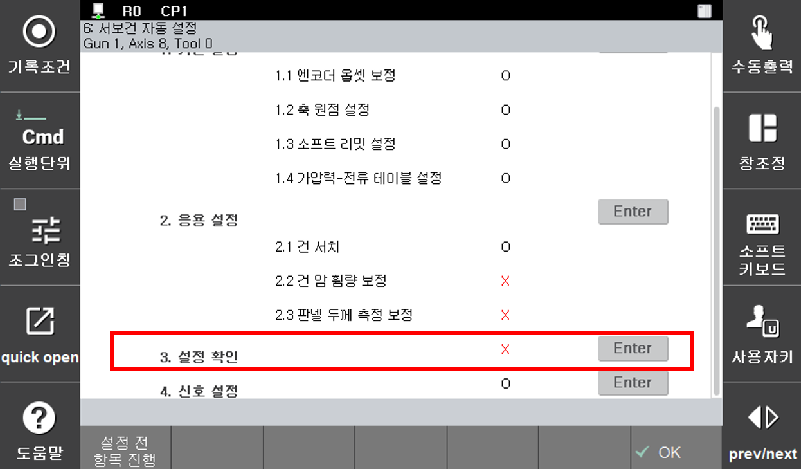

# 2.5 Step 3. 설정 확인

응용 설정이 완료되면 지금까지 ‘설정 확인’ 절차를 통해 설정된 내용을 점검할 수 있습니다. 설정 확인은 기본 설정과 응용 설정이 완료된 상태에서만 실행 가능합니다.

아래와 같이 ‘**Step0. 사전 점검**’, ‘**Step 1. 기본 설정**’, ‘**Step 2. 응용 설정**’이 완료된 상태에서 『**설정 전 항목 진행**』을 누르거나, ‘**Step 3. 설정 확인**’에 포커스를 놓고 엔터를 누르면 설정 확인이 진행됩니다.

 </img>
 <em>
그림 2.18 서보건 설정 확인 화면
</em>

>설정 확인은 서보건을 이동하며 진행되기 때문에 아래 그림과 같이 사전 조건이 반드시 만족되어야 합니다.
>
>* 설정 시 사용한 팁과 동일한 상태의 팁 부착(새 팁 부착 후 팁 드레싱 실행 시 정확한 확인 불가)
>* 서보건 주변 작업자 부재
>* 이동전극과 고정전극 사이에 작업물 부재
>* 수동 모드
>* 모터 온
>* 서보건 기본 설정 완료
>* 서보건 응용 설정 완료

위 조건이 만족되어 설정확인이 진행되면 ‘응용 설정’ 화면으로 이동하여 서보건의 이동 상태 등을 모니터링 할 수 있도록 합니다.

‘설정 확인’이 완료되면 검증 중 추정된 오차를 표시합니다. 표시되는 값은 오차이므로 0에 가까운 값이 나오면 정상적인 설정으로 볼 수 있습니다. 오차가 0보다 큰 값이 나오는 경우 설정을 다시 진행하거나 서보건 및 주변 환경의 변화를 검토해야 합니다. 설정 확인 결과가 만족스러우면 ‘예’를 눌러 ‘설정 확인’ 절차를 종료하십시오. 만약 불만족스러우면 ‘아니요’를 눌러 재설정 하거나 서보건 및 주변 환경의 변화를 점검하십시오.
