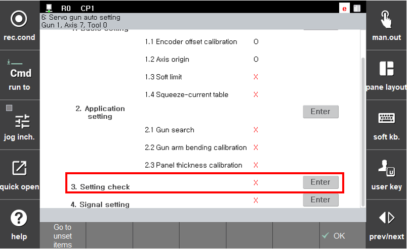

# 2.5 第 3 步. 设置检查

当应用程序设置完成后，您可以通过“设置检查”程序检查到目前为止执行的设置。设置检查程序仅在默认和应用设置完成后才能执行。

如下面所示，当“**第 0 步. 预检**”、“**第 1 步. 默认设置**”和“**第 2 步. 应用设置**”完成后，按下 `Proceed with the prior-to-setting items` 键或将焦点带到“**第 3 步. 设置检查**”部分，然后按下 Enter 键以推进设置检查程序。

 </img>
 <em>
图 2.18 伺服枪设置检查屏幕
</em>

>设置检查在伺服枪移动时进行，因此必须满足以下条件：
>
>* 附件为与设置时使用的尖端相同状态的尖端（如果附上新的尖端并进行尖端修整，则无法正确检查）
>* 伺服枪周围没有工人
>* 移动电极与固定电极之间没有工件
>* 手动模式
>* 电机开启
>* 伺服枪的默认设置已完成
>* 伺服枪的应用设置已完成

当设置检查在以上条件满足时进行，屏幕将切换到“应用设置”屏幕，以便监控伺服枪的运动状态。

当“设置检查”完成时，验证期间估算的错误将被显示。考虑到显示的值是一个错误，如果指示的值接近 0，则可以认为设置是正常的。如果错误值大于零，则需要再次执行设置或检查伺服枪或周围环境是否有任何变化。如果设置检查结果令人满意，请按“是”结束“设置检查”程序。如果结果不令人满意，请按“否”进行重置或检查伺服枪或周围环境。