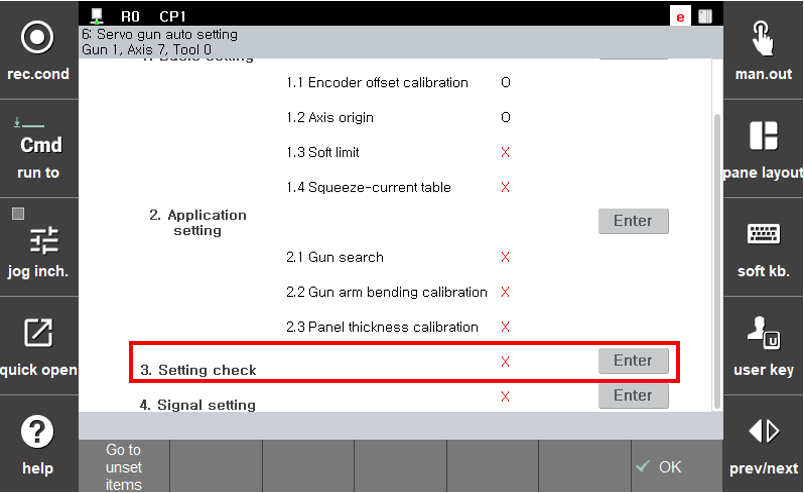

# 2.5 Step 3. Setting check

When the application setting is completed, you can check the setting performed so far through the ‘setting check’ procedure. The setting check procedure can be executed only when the default and application settings are completed.

 As shown below, When ‘**Step 0. Pre-inspection**', '**Step 1. Default setting**', and '**Step 2. Application setting**' are completed, press the 『**Proceed with the prior-to-setting items**』 key or bring the focus onto the '**Step 3. Setting check**' section and then press the Enter key to progress the setting check procedure.

 </img>
 <em>
Figure 2.18 Servo gun setting check screen
</em>

>The setting check will proceed while the servo gun is moving, so the following conditions must be satisfie.
>
>* Attachment of a tip that is in the same state as the tip used for the setting (impossible to check correctly if a new tip is attached and tip dressing is performed)
>* No worker around the servo gun
>* No workpiece between the moving electrode and fixed electrode
>* Manual mode
>* Motor on
>* Completion of the default setting of the servo gun
>* Completion of the application setting of the servo gun

When the setting check proceeds as the above conditions are satisfied, the screen changes to the ‘Application Setting’ screen to make it possible to monitor the movement status of the servo gun.

When the ‘setting check’ is completed, the error estimated during verification will be displayed. Considering that the displayed value is an error, if a value close to 0 is indicated, the setting can be regarded as normal. If the error is a value greater than zero, the setting should be performed again or it is needed to check for any change with the servo gun or surrounding environment. If the setting check result is satisfactory, press ‘Yes’ to end the ‘setting check’ procedure. If the result is unsastisfactory, press ‘No’ to perform resetting or check the servo gun or surrounding environment.
