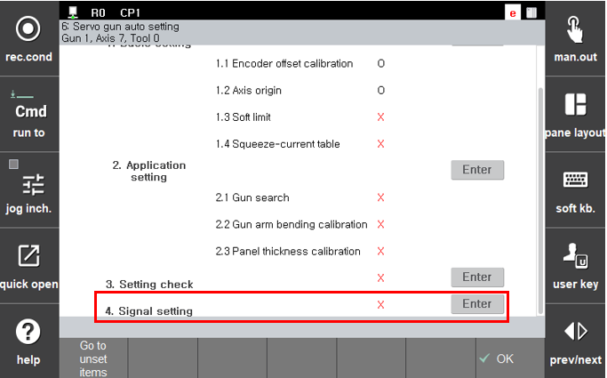

# 2.6 第四步. 信号设置

第三步. 当第三步“设置检查”完成后，伺服枪现在可以正常移动和挤压。然而，对于点焊，必须设置点焊机信号和其他信号的输入和输出。在“信号设置”中，可以设置与点焊相关的输入和输出信号。

如下面的图所示，将光标移动到“**第四步. 输入信号设置**”或“**第四步. 输出信号设置**”，然后按下 \`输入 (Enter)` 键，或者在前面的项目完成后，如果按下『**继续进行前期设置项目**』键，则可以进入相关项目的设置屏幕。

 </img>
 <em>
图 2.19 伺服枪信号设置
</em>

 

1. **输入信号设置**
       * 请参考章节 [5.4 输入信号分配](../5-spot-weld-parameter/5-4-input-signal-assign.md). 
2. **输出信号设置**
       * 请参考章节 [5.5 输出信号分配](../5-spot-weld-parameter/5-5-output-signal-assign.md).