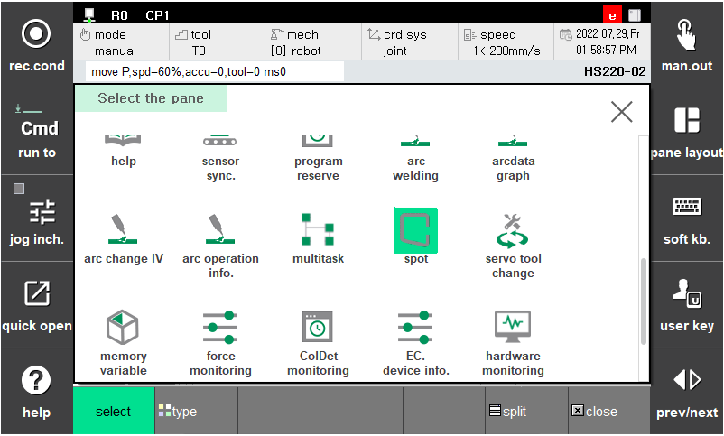
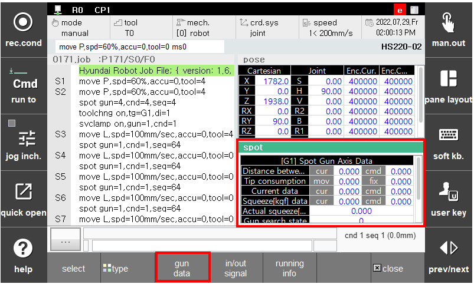

# 3.1.1 Spot gun axis data

This indicates the data of the currently selected spot gun in real time.

(『**Selection**』 → 『**Spot**』 → 『**Gun data**』)

 </img>
 <em>
Figure 3.1 Spot monitoring pane
</em>

 </img>
 <em>
Figure 3.2 Spot gun data monitoring
</em>

>*   **Current data (servo gun)**
>
>      Cur indicates the feedback current of the axis of the servo gun and Cmd indicates the current limit command value (A).
>*   **Squeezing force data (servo gun)**
>
>     ‘**The command current and feedback current are converted into squeezing force and displayed using the “squeezing force - current table**” of the welding gun parameter. Cmd indicates the command squeezing force and Cur indicates the feedback squeeze.&#x20;
>*   **Actual squeezing force during weling (servo gun)**
>
>     Indicates the average squeezing force from the point of the matching of the squeezing force to the time of opening.
>*   **Distance between electrodes (servo gun)**
>
>     Indicates the distance (mm) from the axis origin to the moving electrode.
>*   **Electrode consumption amount (servo gun, equalizerless gun)**
>
>     Inidicates the consumption amount (mm) detected through gun search. (In the case of the equalizerless gun, only the consumption amount of the fixed electrode is managed.)
>*   **Gun search status (servo gun, equalizerless gun)**
>
>     Indicates whether gun search is performed.
>*   **Welder number**
>
>     Indicates the welder number corredponding to the currently selected gun number.
>*   **SvClamp (servo gun)**
>
>     Indicates the status of the clamping operation of the currently selected gun.
