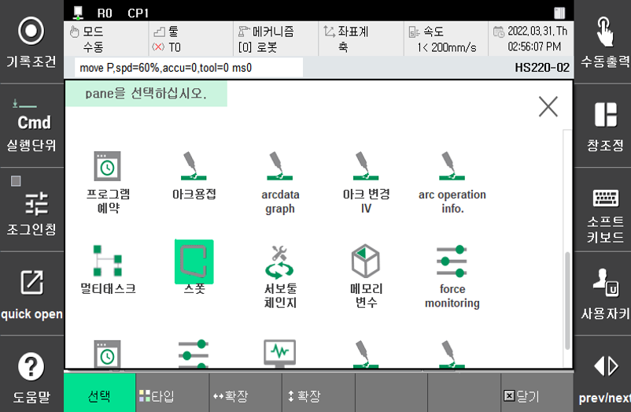
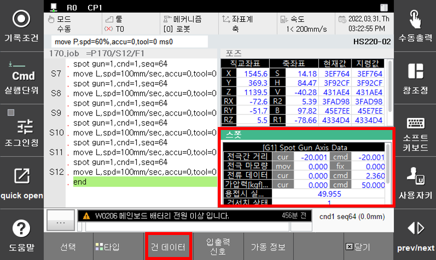

# 3.1.1 스폿건 축 데이터

현재 선택된 스폿건에 대한 데이터를 실시간으로 표시합니다.

(『**선택**』 → 『**스폿**』 → 『**건 데이터**』)

 </img>
 <em>
그림 3.1 스폿 모니터링 pane
</em>

 </img>
 <em>
그림 3.2 스폿 건 데이터 모니터링
</em>

>*   **전류 데이터(서보건)**
>
>      Cur은 서보건축의 피드백 전류를 Cmd는 전류제한 지령 값(A)을 표시합니다.
>*   **가압력 데이터(서보건)**
>
>     ‘**용접건 파라미터의 가압력 - 전류 테이블**’을 이용하여 지령 전류와 피드백 전류를 가압력으로 환산하여 표시합니다. Cmd에는 지령 가압력이 표시되고, Cur에는 피드백된 가압력이 표시됩니다.&#x20;
>*   **용접시 실가압력(서보건)**
>
>     가압일치 시점부터 개방시점까지의 평균가압력을 표시합니다.
>*   **전극간 거리(서보건)**
>
>     축 원점으로부터 이동전극간의 거리(mm)를 표시합니다.
>*   **전극 마모량(서보건, Eqless건)**
>
>     건서치로 검출한 마모량(mm)을 표시합니다. (Eqless건은 고정측 전극의 마모량만 관리)
>*   **건서치 상태(서보건, Eqless건)**
>
>     건서치 수행 여부를 표시합니다.
>*   **용접기 번호**
>
>     현재 선택된 건번호에 대한 용접기 번호를 표시합니다.
>*   **SvClamp(서보건)**
>
>     현재 선택된 건의 클램핑 동작 상태를 표시합니다.
