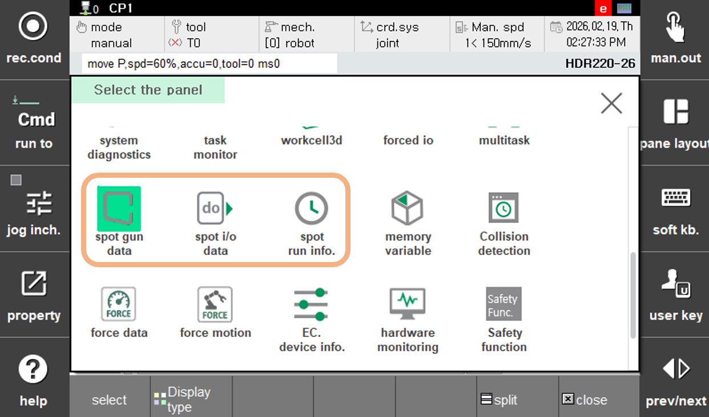
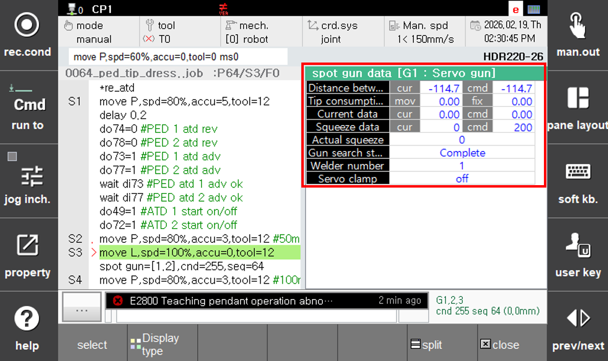

### 3.1.1 点焊枪轴数据

这表示实时当前选定点焊枪的数据。  
(`[pane layout] - [F1: 选择] - 点焊数据 ([pane layout] - [F1: select] - spot gun data)`)

 </img>
 <em>
图 3.1 点监测面板
</em>

 </img>
 <em>
图 3.2 点焊枪数据监测
</em>

 

* 当前数据 (伺服枪)

      Cur 表示伺服枪轴的反馈电流，Cmd 表示电流限制命令值 (A)。

* 压紧力数据 (伺服枪)

     命令电流和反馈电流被转换为压紧力，并使用焊接枪参数的“压紧力 - 电流表”显示。Cmd 表示命令压紧力，Cur 表示反馈压紧。

* 焊接过程中实际压紧力 (伺服枪)

     表示从压紧力匹配点到开启时间的平均压紧力。

* 电极间距 (伺服枪)

     表示从轴原点到移动电极的距离 (mm)。

* 电极消耗量 (伺服枪，无平衡枪)  

     表示通过枪搜索检测到的消耗量 (mm)。 (在无平衡枪的情况下，仅管理固定电极的消耗量。)

* 材料检索状态 (伺服枪，无平衡枪) 

     表示是否进行了枪搜索。

* 焊工编号

     表示与当前选定枪编号对应的焊工编号。

* SvClamp (伺服枪)

     表示当前选定枪的夹紧操作状态。