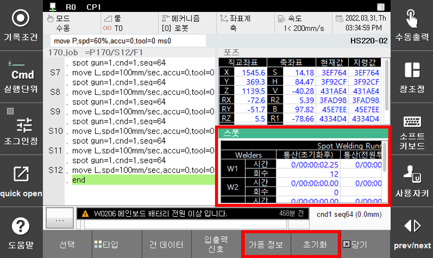
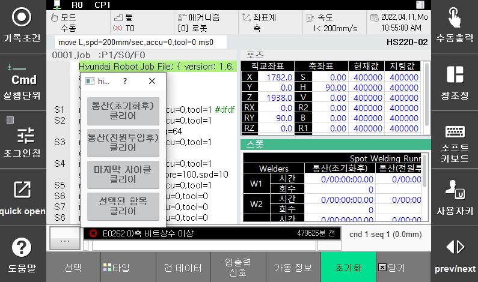

# 3.1.3 Information of the operating time

This allows you to check the information of the operating time related to the spot welding.

(『**Selection**』 → 『**Spot**』 → 『**Operation information**』)

 </img>
 <em>
Figure 3.4 Spot welding operation information monitoring
</em>

>*   **Total (after initialization)**
>
>      Indicates the operation time and welding count of each welder since initialization of the system.
>*   **Total (after input of power)**
>
>     Indicates the operation time and welding count of each welder since input of the power.
>*   **Latest cycle**
>
>     Indicates the operation time and welding count of each welder of the immediately preceeding cycle.
>*   **Current cycle**
>
>     Indicates the operation time and welding count of each welder of the current cycle.

---
-	Spot welding operation information clearing

When the spot welding operation information window is activated, the 『Clear』 button will be displayed. Pressing the button will bring up a dialog box for clearing the operation information as shown in Figure 3.5.

 </img>
 <em>
Figure 3.5 Spot welding operation information initialization screen
</em>

