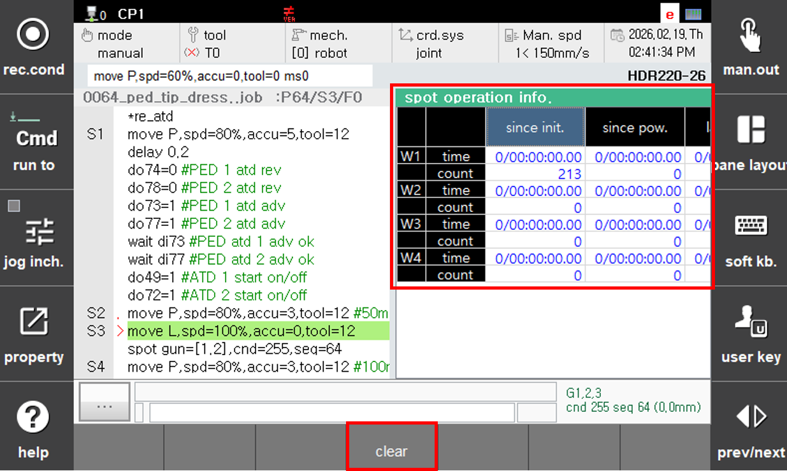
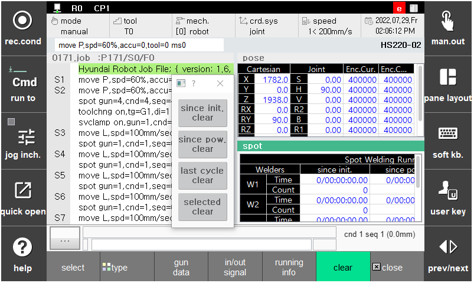

### 3.1.3 操作时间信息

这允许您检查与点焊相关的操作时间信息。

(`[pane layout] - [F1: 选择] - 点焊 运行信息 ([pane layout] - [F1: select] - spot run info.)`)

 

 </img>
 <em>
图 3.4 点焊操作信息监控
</em>

 

*   **总计（初始化后）**

      表示自系统初始化以来每个焊接器的操作时间和焊接次数。
*   **总计（通电后）**

     表示自通电以来每个焊接器的操作时间和焊接次数。
*   **最近周期**

     表示上一个周期中每个焊接器的操作时间和焊接次数。
*   **当前周期**

     表示当前周期中每个焊接器的操作时间和焊接次数。

---
-	点焊操作信息清除

当点焊操作信息窗口被激活时，将显示 `[Clear]` 按钮。按下按钮将弹出一个对话框以清除操作信息，如图 3.5 所示。

 </img>
 <em>
图 3.5 点焊操作信息初始化屏幕
</em>

