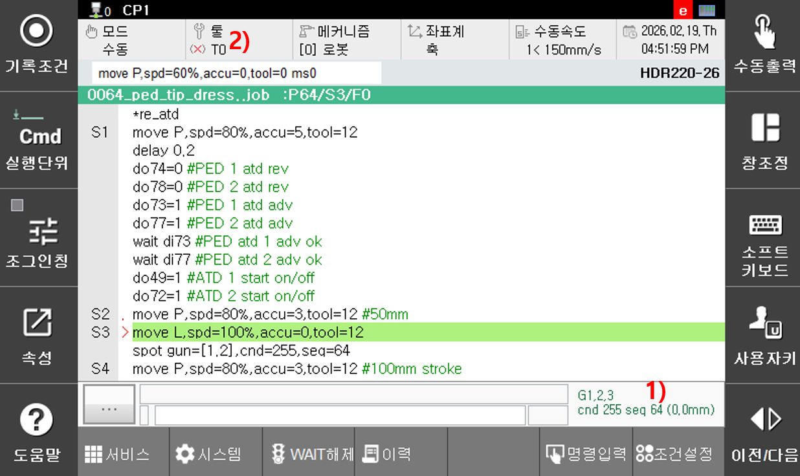

### 3.1.4 상태플래그

스폿용접과 관련하여 필요한 각종 상태는 다음의 화면과 같이 표시됩니다.

 </img>
 <em>
그림 3.6 스폿 용접 관련 상태 표시
</em>

-  **건 번호, 용접조건, 용접시퀀스 (판넬 두께)**  
    - 현재 선택된 건 번호 및 멀티건 번호를 표시합니다.
    - 현재 선택된 용접조건 번호와 용접시퀀스 번호를 표시합니다.
    - 현재 설정된 판넬 두께를 표시합니다. 서보건 용접스텝 기록시 서보건 축의 위치가 설정된 판넬 두께를 기준으로 자동으로 생성되기 때문에 정확하게 설정되어야 합니다. `R220`으로 수동으로 설정할 수도 있으며 수동가압 후 용접스텝 기록시에는 현재 건의 위치를 고려하여 자동으로 설정됩니다.
-  **툴 번호**
    - 현재 선택된 건 번호에 대응되는 툴 번호를 표시합니다. 즉, 건 번호를 변경하면 `[F2: 시스템] - 4: 응용 파라미터 - 1: 스폿용접 - 2: 용접건 파라미터`에서 설정된 툴 번호로 자동 변경됩니다.

