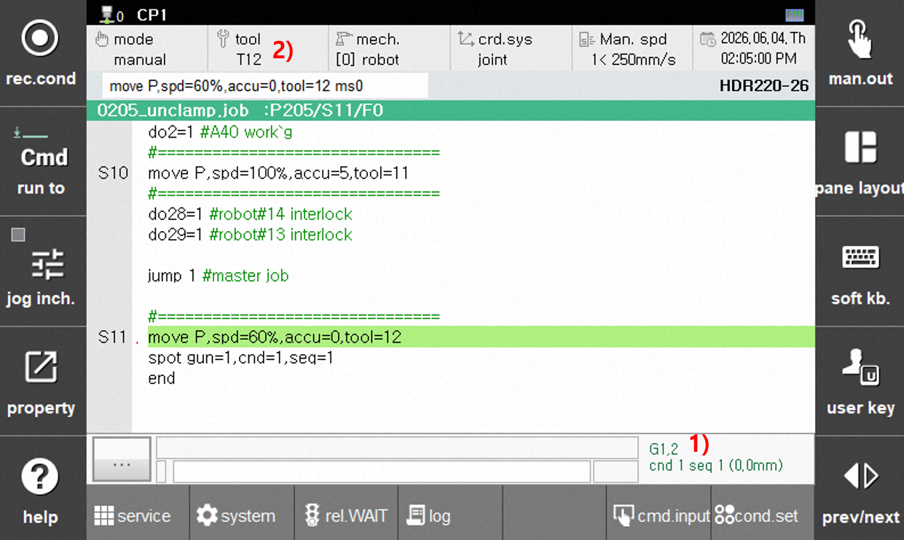

### 3.1.4 状态标志

与点焊相关的各种必要状态将如下面的屏幕所示进行指示。

 </img>
 <em>
图 3.6 点焊相关状态的指示
</em>

-  焊接条件和焊接顺序（面板厚度）

    - 指示当前选择的焊接条件编号和焊接顺序编号。
    - 指示当前设置的面板厚度。由于伺服枪的轴位置将在记录焊接步骤时根据设置的面板厚度自动生成，因此需要准确设置。也可以使用 R220 进行手动设置。当在手动压缩操作后进行焊接步骤记录时，设置将根据伺服枪的当前位置自动完成。

-  工具编号

    - 指示当前选择的枪编号对应的工具编号。换句话说，如果您更改枪编号，工具编号将自动更改为在 `[F2: 系统] - 4: 应用参数 - 1: 点焊 - 2: 焊接枪参数 ([F2: system] - 4: Application parameter - 1: Spot welding - 2: Welding gun parameter)` 中设置的工具编号。

-  枪编号

    - 这指示当前选择的枪编号、多把枪的编号及伺服枪分离状态 (). 例如，如果 G5 和 G6 被指示，意味着选中了静止枪 G5 和 G6 进行同时焊接。此外，还有一个锁的标记，因此可以知道伺服枪已断开。