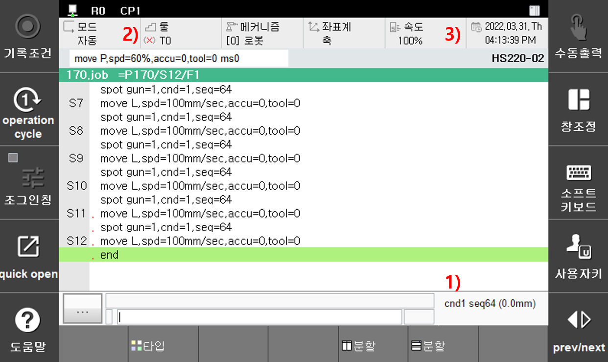

# 3.1.3 상태플래그

스폿용접과 관련하여 필요한 각종 상태는 다음의 화면과 같이 표시됩니다.

1.  **용접조건, 용접시퀀스 (판넬 두께)**

    현재 선택된 용접조건 번호와 용접시퀀스 번호를 표시합니다.
2.  **툴 번호**

    현재 선택된 건 번호에 대응되는 툴 번호를 표시합니다. 즉, 건 번호를 변경하면 『**설정]: 시스템**』 → 『**4: 응용 파라미터**』 → 『**1: 스폿용접**』 → 『**1: 건번호 대응 툴 번호, 건타입 설정**』에서 설정된 툴 번호로 자동 변경됩니다.
3.  **건 번호**

    해당 항목에서는 현재 선택된 건 번호, 멀티건 번호, 서보건 분리상태(.png>))를 표시합니다. 예를 들어 G5,6과 같이 표시된 경우는 정치건 5, 6번이 동시 용접을 위해 선택된 상태라는 것을 의미합니다. 그리고 자물쇠 표시가 되어 있으므로 서보건이 분리 되었음을 알 수 있습니다.&#x20;

    현재 설정된 판넬 두께를 표시합니다. 서보건 용접스텝 기록시 서보건 축의 위치가 설정된 판넬 두께를 기준으로 자동으로 생성되기 때문에 정확하게 설정되어야 합니다. R220으로 수동으로 설정할 수도 있으며 \[**수동가압**]후 용접스텝 기록시에는 현재 건의 위치를 고려하여 자동으로 설정됩니다.
