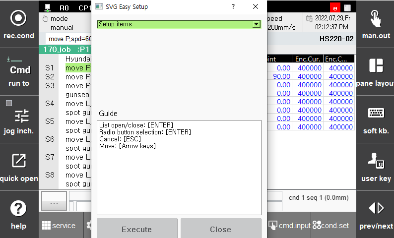

# 3.2 Simple maintenance of the servo gun

This provides support to simply conduct a series of settings to restart the servo gun from a single window after repairing it. When you press the \[**CTRL**]+\[**GUN**] keys on the initial screen, a dialog box for simple maintenance will be displayed.

 </img>
 <em>
Figure 3.7 Simple maintenance of the servo gun
</em>

>*   **Serial encoder reset**  
>    Executes the “**encoder reset**” or “**error clear**” operation for the serial encoder attached to the servo gun motor. Power must be supplied again for the changed setting to be applied. When “encoder reset” is performed, the encoder information will be initialized after that, requiring you to newly perform the encoder offset setting, axis origin setting, and gun search reference position recording.
>*   **Encoder offset**  
>    Sets the encoder origin of the axis of the servo gun.  It should be set at the position where the moving electrode is maximally opened through the releasing of the brake manually.
>*   **Axis origin**  
>    Sets the axis origin of the servo gun. The axis origin of the servo gun should be set at the poistion where electrodes are in contact with each other after new electrodes are installed.
>*   **Gun search execution**  
>    Executes the gunsea command only by operating the axis of the servo gun at the current position.
>*   **Welding execution**  
>    Executes the spot command only by operating the axis of the servo gun at the current position.
