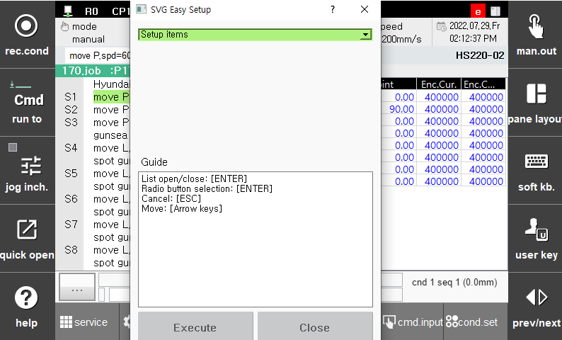

# 3.2 伺服枪的简单维护

这提供了支持，可以在修理后从一个窗口简单地进行一系列设置以重新启动伺服枪。当您在初始屏幕上按下 \`CTRL\`+\`GUN\` 键时，将显示简单维护的对话框。

 </img>
 <em>
图 3.7 伺服枪的简单维护
</em>

>*   **串行编码器重置**  
>    执行连接到伺服枪电机的 "**编码器重置**" 或 "**错误清除**" 操作。必须重新供电以应用更改的设置。当执行 "编码器重置" 时，编码器信息将被初始化，您需要重新进行编码器偏移设置、轴原点设置和枪搜索参考位置记录。
>*   **编码器偏移**  
>    设置伺服枪的轴的编码器原点。 应在通过手动释放制动器使移动电极最大打开的位置进行设置。
>*   **轴原点**  
>    设置伺服枪的轴原点。伺服枪的轴原点应设置在新安装的电极相互接触的位置。
>*   **枪搜索执行**  
>    仅通过在当前位置操作伺服枪的轴来执行枪搜索命令。
>*   **焊接执行**  
>    仅通过在当前位置操作伺服枪的轴来执行点焊命令。