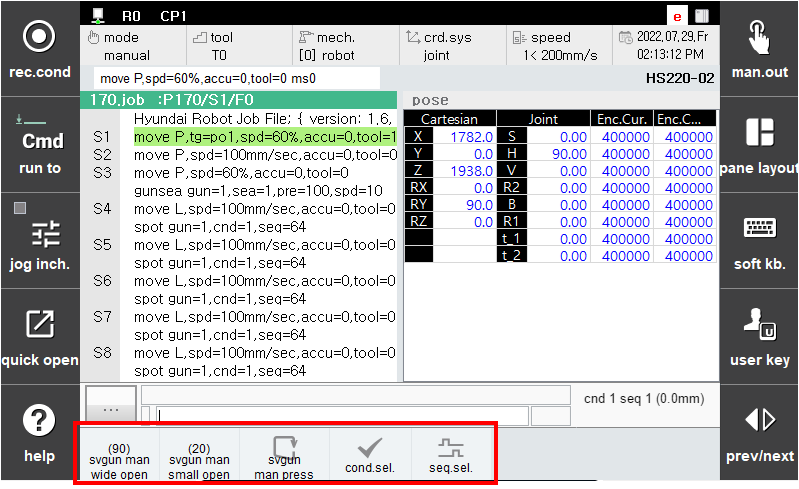

# 3.3 用户键

这是与点焊相关的用户键的描述。在初始主屏幕的右下角有一个用户键按钮。每次按下按钮时，注册的菜单会更改。按下与点焊相关的每个用户键两次以进入相应的菜单。

 </img>
 <em>
图 3.8 点焊用户键
</em>

>*   **伺服枪宽开口**  
>    手动将伺服枪移动到宽开口位置。
>*   **伺服枪手动关闭**  
>    手动将伺服枪移动到窄开口位置。
>*   **伺服枪手动挤压**  
>    手动挤压伺服枪。
>*   **焊接条件改变**  
>    手动更改当前选择的焊接条件编号。
>*   **焊接序列改变**  
>    手动更改当前选择的焊接序列编号。