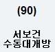
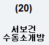
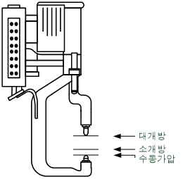
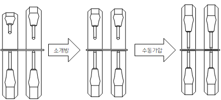

# 3.4 Welding gun manual closing and squeezing

The procedure for manual closing and squeezing of the welding gun is as follows.

 

1. Check whether the mode is manual. In the case of the servo gun, input the operation preparation signal to drive the axis of the servo gun. 
2.  Select the gun number for the manual closing or squeezing operation. The method to select a gun number is as follows.

    | **Gun type** |   Whether to change  | R code |
    | :-----: | :---------: | :--------------: |
    | Sole gun |    For change of the welding gun  | R358 (welding gun connection/separation) |
    |    Sole gun     | Not for change of the welding gun |   R210 (welding gun selection)  |
    | Multiple guns |      -       |  R214 (selection of guns for simultaneous welding) |

3.  Check whether the following \[**user**] keys are registerd.

    |       **Wide opening**  |       **Narrow opening**    | **Manual squeezing**   |
    | :--------------------------------------: | :--------------------------------------: | :--------------------------------------: |
    | </img>|</img> | </img> |

1.  When you press the “\[**SHIFT**] and \[**user**]” keys at the same time, the following operation will be performed. When multiple guns are selected, all of the selected guns will operate in the same way.

    |                  **Servo gun**                 |
    | :--------------------------------------: |
    | </img> |

The servo gun has the following characteristics during the manual closing and squeezing operations.

* The servo gun automatically stops at the wide opening position, the narrow opening position, and the position where the squeezing force reaches the set value.
* The moving speed is the speed inputted in 『**2: Maximum speed during step forward/backward**』 in 『**Condition setting**.』 
* If the set squeezing force is small, the servo gun will not move even when it is operated. Considering it, set a sufficient squeezing force (R211: Squeezing force setting).
* When it comes to multiple guns, if there is a difference in the moving distance between two guns, the gun that reaches first will stop while the other gun will stop after moving as much as the remaining distance.

 </img>
 <em>
Figure 3.9 Spot gun manual operation
</em>

