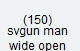
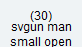
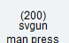
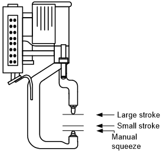
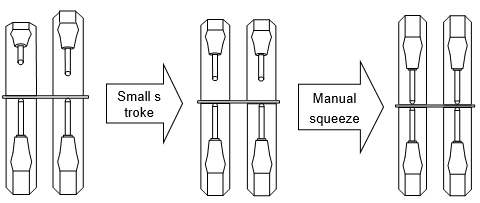

# 3.4 焊接枪手动关闭和挤压

焊接枪的手动关闭和挤压的程序如下。

 

1. 检查模式是否为手动。在伺服枪的情况下，输入操作准备信号以驱动伺服枪的轴。
2. 选择手动关闭或挤压操作的枪号。选择枪号的方法如下。

    | **枪类型** |   是否更换  | R 代码 |
    | :-----: | :---------: | :--------------: |
    | 单枪 |    更换焊接枪  | R358 (焊接枪连接/分离) |
    |    单枪     | 不更换焊接枪 |   R210 (焊接枪选择)  |
    | 多把枪 |      -       |  R214 (同时焊接的枪选择) |

3. 检查以下用户键是否已注册。

    |       **宽开启**  |       **窄开启**    | **手动挤压**   |
    | :--------------------------------------: | :--------------------------------------: | :--------------------------------------: |
    | </img>|</img> | </img> |

1.  当同时按下 `[SHIFT]+[用户键]` 时，将执行以下操作。当选择多个枪时，所有选定的枪将以相同方式操作。

    |                  **伺服枪**                 |
    | :--------------------------------------: |
    | </img> |

在手动关闭和挤压操作期间，伺服枪具有以下特性。

* 伺服枪会自动停在宽开启位置、窄开启位置和挤压力达到设定值的位置。
* 移动速度是通过 `[F7: 条件设置] ([F7: cond.set])` 输入的 **最大前进/后退速度**。
* 如果设定的挤压力过小，伺服枪即使在操作时也不会移动。考虑到这一点，设定一个足够的挤压力 (R211: 挤压力设置)。
* 当涉及到多把枪时，如果两把枪之间的移动距离存在差异，先到达的枪将停止，而另一把枪将在移动到剩余距离后停止。

 </img>
 <em>
图 3.9 点焊枪手动操作
</em>

