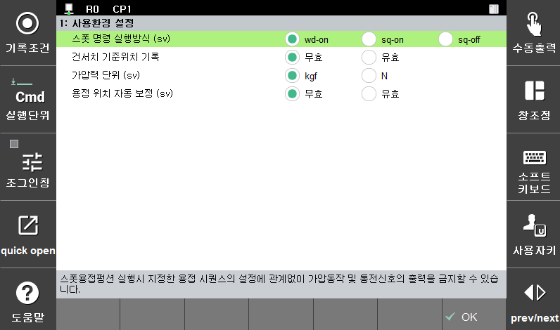

# 4.1.3 Gun search reference position record

The consumption amount of an electrode is measured based on an unconsumed new tip. Therefore, the process of registering the reference position with a new tip is absolutely necessary at least once in the beginning, and this is called gun search reference position record.


[Caution]
**The gun search reference position must be recorded at least once before the execution of gun search**


 When it comes to the method of recording a gun search reference position, new tips should be attached first and then the recording should be executed according to the following procedures.

 </img>
 <em>
Figure 4.2 Use environment setting screen
</em>

>1. Set 『**2: Gun search reference position record**』 to <**Valid**>.
>2. Execute the created gun search program. In the spot monitoring screen, the state of the gun search will be initialized to “**Incomplete**”.
>3. Set 『**2: Gun search reference position record**』 to <**Invalid**>. After that, the amount of variation compared to the reference position will be calculated as a consumption amount by using the gun search program.
