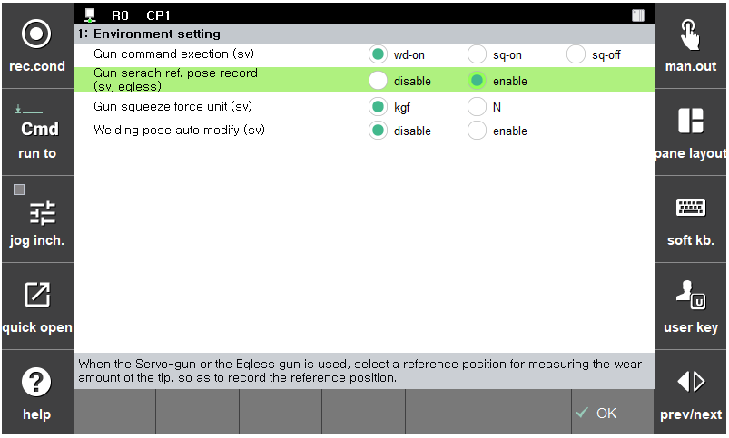

### 4.1.3 枪搜索参考位置记录

电极的消耗量是基于未消耗的新尖测量的。因此，使用新尖注册参考位置的过程在开始时至少必须执行一次，这被称为枪搜索参考位置记录。


**在执行枪搜索之前，必须至少记录一次枪搜索参考位置**


 关于记录枪搜索参考位置的方法，应该首先附上新尖，然后根据以下程序执行记录。

 </img>
 <em>
图 4.2 使用环境设置屏幕
</em>

>1. 将'枪搜索参考位置记录'设置为'启用'。
>2. 执行创建的枪搜索程序。在现场监控屏幕上，枪搜索的状态将初始化为'不完整'。
>3. 将'枪搜索参考位置记录'设置为'禁用'。之后，将使用枪搜索程序计算与参考位置相比的变化量作为消耗量。