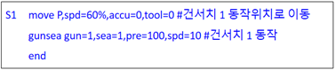
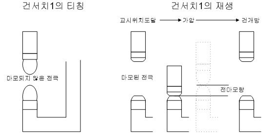
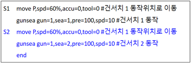
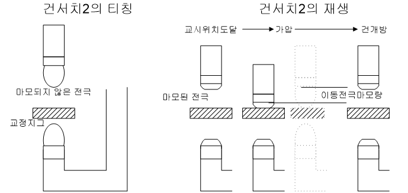
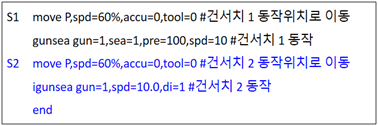
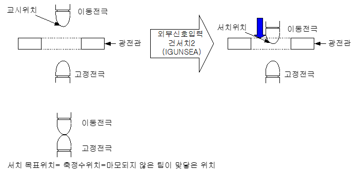

# 4.1.4.1 Servo gun

The gun search function of the servo gun is initially set in a way that the total electrode consumption amount reflects 50% of each of the fixed electrode consumption amount and moving electrode consumption amount. Therefore, the electrode consumption amount can be calculated by using only gun search 1. If you want to calculate the consumption amounts of the fixed and moving electrodes respectively, please refer to the description of gun search 2.


\[Caution\]  
If the set value of『**Moving electrode consumption amount/Total consumption amount (%)**』 is “0”, the gun search 2 operation must be performed. If it is not “0”, the total consumption amount will be distributed according to the set ratio through the gun search 1 operation.


(1) Gun search 1

    Measures the total electrode consumption amount by making the moving electrode squeeze the fixed electrode.

 </img>
 </img>
 <em>
Firgure 4.3 Gun search 1
</em>

>1. The servo gun moves to the record position of the step. 
>2. The fixed electrode is squeezed with the moving electrode until the set squeeze force is reached.
>3.  When the squeezing force matching is detected, the total electrode consumption amount is measured and the opening operation is executed.  
>    Total electrode consumption amount = Squeezing force matching detection position  - gun search 1 reference position
>4. The servo gun opens up to the record position of the step.
>5. In an environment where only gun search 1 is operating, the measured total electrode consumption amount is distributed according to the ratio between the moving electrode and fixed electrode as shown in the figure below. (default is 50 : 50.)

  </img>
 <em>
Figure 4.4 Calculation of the electrode consumption amount through gun search 1
</em>

(2) Gun search 2

Measures the moving electrode consumption amount. The measurement can be performed by using a squeezing force or an external signal.

*   **By using a squeezing force**

    Measures the moving electrode consumption amount by making the moving electrode squeeze the calibration jig.

 </img>
 </img>
 <em>
Figure 4.5 Gun search by using a squeezing force
</em>

>1. Movement to the record position of the step occurs.
>2. The calibration jig is squeezed with the moving electrode through searching unitil the set squeezing force is reached.
>3.  When the squeezing force matching is detected, the moving electrode consumption amount is detected and the opening operation is executed.   
>    **Moving electrode consumption amount = Squeezing force matching detection position - reference position for gun search 2 that uses the squeezing force**  
>    **Fixed electrode consumption amount = total consumption amount detected by gun search 1 – moving electrode consumption amount**
>4. When the opening is completed, the consumption amounts of the moving and fixed electrodes are updated. 

*   **By using an external signal**

    When the moving electrode moves to the position where the sensor is located and then the input from the sensor is detected, the moving electrode consumption amount is measured.

 </img>
 </img>
 <em>
Figure 4.6 Gun search 2 that uses an external signal input
</em>

>1. Movement to the record position of the step occurs.
>2. The moving electrode approaches at the search speed and switches the phototube contact signal.
>3.  When a signal is detected by the photo tube, the moving electrode consumption amount is detected and the opening operation is executed.  
 >   **Moving electrode consumption amount = External signal detection position - reference position for gun search 2 that uses the external signal**  
 >   **Fixed electrode consumption amount = total consumption amount detected by gun search 1 - moving electrode consumption amount**  
>4. When the opening is completed, the consumption amounts of the moving and fixed electrodes are updated.
