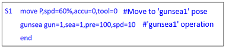
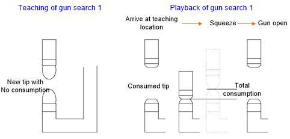
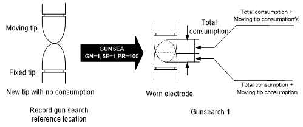
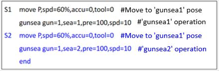
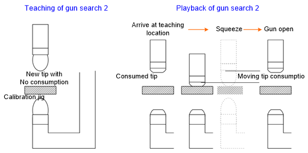
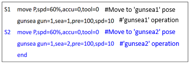
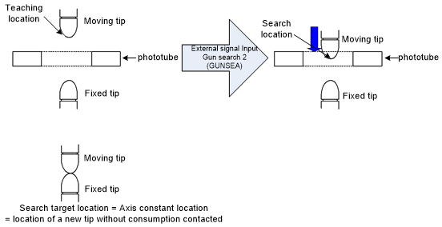

#### 4.1.4.1 服务枪

服务枪的枪搜索功能最初设置为总电极消耗量反映固定电极消耗量和移动电极消耗量各50%。因此，可以仅通过枪搜索1来计算电极消耗量。如果您想分别计算固定电极和移动电极的消耗量，请参阅枪搜索2的说明。


如果设置的**移动电极消耗量/总消耗量（%）**的值为“0”，则必须执行枪搜索2操作。如果不为“0”，总消耗量将通过枪搜索1操作按设置的比例进行分配。


 

(1) 枪搜索1  
  - 通过使移动电极挤压固定电极来测量总电极消耗量。

 </img>
 </img>
 <em>
图4.3 枪搜索1
</em>

1. 服务枪移动到步骤的记录位置。  

2. 移动电极以达到设定的挤压力挤压固定电极。  

3. 当检测到挤压力匹配时，测量总电极消耗量并执行开启操作。总电极消耗量 = 挤压力匹配检测位置 - 枪搜索1参考位置

4. 服务枪打开到步骤的记录位置。  

5. 在仅运行枪搜索1的环境中，测量的总电极消耗量按移动电极与固定电极之间的比例进行分配，如下图所示。（默认是50 : 50。）

  </img>
 <em>
图4.4 通过枪搜索1计算电极消耗量
</em>

(2) 枪搜索2

- 测量移动电极消耗量。可以通过使用挤压力或外部信号进行测量。

-   **使用挤压力**

    通过使移动电极挤压校准夹具来测量移动电极消耗量。

-   **使用外部信号**

    当移动电极移动到传感器所在的位置并检测到传感器输入时，测量移动电极消耗量。
</img>
</img>
<em>
图4.5 使用挤压力的枪搜索
</em>

 

1. 发生步骤的记录位置移动。

2. 校准夹具通过搜索被移动电极挤压，直到达到设定的挤压力。

3. 当检测到匹配的挤压力时，检测移动电极的消耗量并执行开口操作。   
    - 移动电极消耗量 = 挤压力匹配检测位置 - 用于枪搜索2的参考位置
    - 固定电极消耗量 = 枪搜索1检测到的总消耗量 - 移动电极消耗量

4. 完成开口后，更新移动电极和固定电极的消耗量。 

</img>
</img>
<em>
图4.6 使用外部信号输入的枪搜索2
</em>

 

1. 发生步骤的记录位置移动。  

2. 移动电极以搜索速度靠近并切换光电管接触信号。  

3. 当光电管检测到信号时，检测移动电极的消耗量并执行开口操作。  
    - 移动电极消耗量 = 外部信号检测位置 - 用于外部信号的枪搜索2的参考位置
    - 固定电极消耗量 = 枪搜索1检测到的总消耗量 - 移动电极消耗量

4. 完成开口后，更新移动电极和固定电极的消耗量。