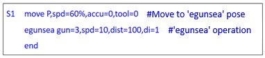
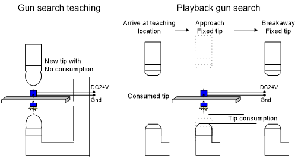

#### 4.1.4.2 Equalizerless gun

As an equalizerless gun only manages the consumption amount on the fixed electrode, so the gun search function here measures the fixed electrode consumption amount.

 </img>
 </img>
 <em>
Figure 4.7 Gun search of an equalizerless gun
</em>

 

1. The robot moves to the recorded position of the step.

2. The fixed electrode approaches at the search speed and activates the phototube contact signal.

3. When the phototube detects a signal, the fixed electrode consumption amount is measured and the opening operation is executed.

   Fixed electrode consumption  = sensor detection position - gun search recorded position

4. When the opening operation is completed, the fixed electrode consumption amount is updated.