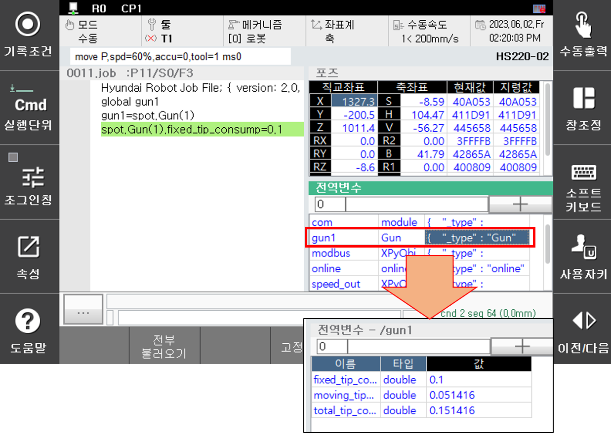

# 4.10 마모량 설정

아래의 시스템 변수는 건의 전체 마모량을 임의로 설정하거나, 건서치로 측정한 전체 마모량을 저장하고 있습니다.

건의 마모량 관련 정보는 스폿 모듈 기능을 이용하여 설정하거나 확인할 수 있습니다. 스폿 모듈은 명령어 창에 스폿 모듈 변수를 선언하고 이동전극, 고정전극의 마모량 및 전체 마모량 값을 관리할 수 있습니다.

 </img>
 <em>
그림 4.23 스폿 마모량 관리
</em>

 


- 서보건 및 Eqless 건에만 적용이 가능하며, Eqless건의 경우 전체 마모량은 고정전극 마모량과 같습니다.
- 임의 설정한 마모량 값은 건서치 이후 변경됩니다.

