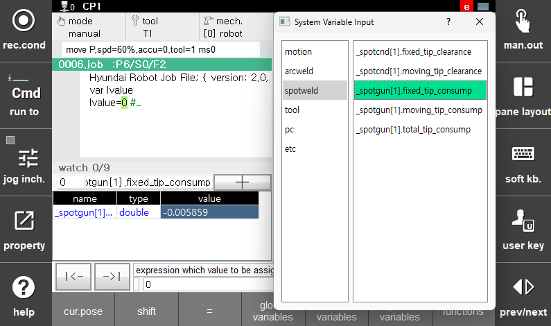

# 4.10 Spot 系统变量

某些设置值可以通过 Spot 系统变量进行访问和控制。这些变量存储每种条件的间隙值、移动和固定电极的个体磨损值，以及总磨损量。如下面插图所示，您可以通过在命令窗口中使用变量赋值语句来读取或修改这些值。

 </img>
 <em>
图 4.23 Spot 尖端消耗系统变量使用
</em>

 

|category	|system variable	|content|
|:--:	|:--:	|:--:|
|welding condition|_spotcnd[#].fixed_tip_clearance|	条件编号(#)的固定尖端间隙值|
|welding condition|_spotcnd[#].moving_tip_clearance|	条件编号(#)的移动尖端间隙值|
|welding gun|_spotgun[#].fixed_tip_consump|	枪编号(#)的固定尖端消耗|
|welding gun|_spotgun[#].moving_tip_consump|	枪编号(#)的移动尖端消耗|
|welding gun|_spotgun[#].total_tip_consump|	枪编号(#)的总消耗|

 


- 与消耗相关的变量只能应用于伺服和无平衡器枪。
- 对于无平衡器枪，总消耗量等于固定电极消耗量。
- 任何手动设置的磨损量将被测量值覆盖，在进行枪搜索后。
