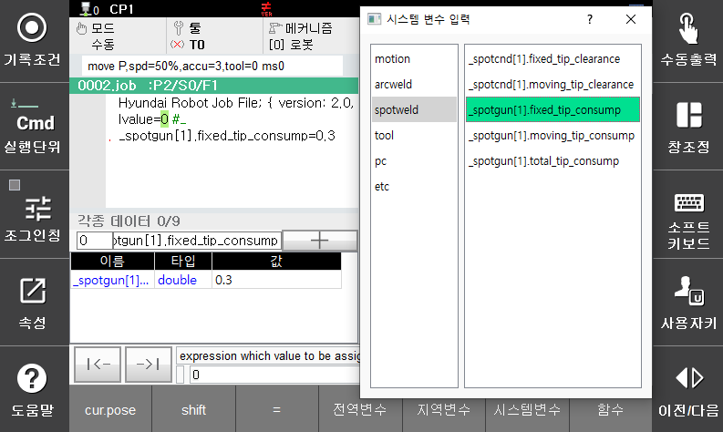

# 4.10 마모량 설정

스폿건의 마모량 정보는 스폿 시스템 변수를 이용하여 접근할 수 있습니다. 스폿 시스템 변수는 각 건별로 이동전극, 고정전극의 마모량 및 전체 마모량 값을 표시하고 있으며, 명령어 창에 변수 대입문을 이용하여 수정하거나 읽어올 수 있습니다.

 </img>
 <em>
그림 4.23 스폿 마모량 시스템 변수
</em>

 


- 서보건 및 Eqless 건에만 적용이 가능합니다.
- 임의 설정한 마모량 값은 건서치 이후 측정된 값으로 변경됩니다.

